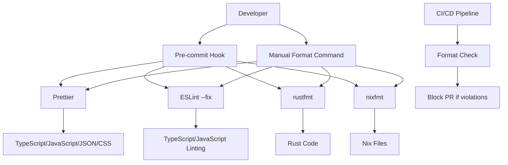

# Design Document

## Overview

This design establishes a comprehensive formatting consistency system for the monorepo that
addresses the current fragmented formatting setup. The solution will unify formatting
configurations, provide automated formatting tools, and integrate with the existing CI/CD pipeline
to prevent formatting inconsistencies from being merged.

### Current State Analysis

The codebase currently has:

- Basic Prettier configuration (`.prettierrc`) with minimal settings
- ESLint integration with Prettier via `eslint-plugin-prettier`
- Separate Rust formatting configurations in multiple locations (`rustfmt.toml`)
- Limited formatting script (`fix:formatting`) that only covers `apps/web`
- No Nix formatting configuration
- No automated formatting validation in CI/CD

### Problems Identified

1. **Incomplete Coverage**: Current formatting only covers `apps/web`, leaving other apps and libs
   unformatted
2. **Inconsistent Rust Configs**: Multiple `rustfmt.toml` files with identical content
3. **Missing Nix Formatting**: No formatting rules for `.nix` files
4. **No CI Integration**: No automated validation to prevent formatting violations
5. **Limited Tooling**: No comprehensive formatting commands for the entire codebase

## Architecture

### Formatting Tool Stack



### Configuration Hierarchy

1. **Root Level**: Primary configurations for workspace-wide settings
2. **Language Specific**: Specialized configs for Rust, Nix, etc.
3. **Project Level**: Override configurations where needed (minimal use)

## Components and Interfaces

### 1. Unified Configuration System

#### Prettier Configuration Enhancement

- Extend current `.prettierrc` with comprehensive settings
- Add support for all file types in the monorepo
- Configure consistent formatting rules across TypeScript, JavaScript, JSON, CSS, Markdown

#### ESLint Integration

- Maintain existing `eslint-plugin-prettier` integration
- Ensure ESLint formatting rules don't conflict with Prettier
- Configure ESLint to handle TypeScript-specific formatting

#### Rust Formatting Consolidation

- Create single root-level `rustfmt.toml`
- Remove duplicate configurations from individual projects
- Ensure consistent Rust formatting across all Rust projects

#### Nix Formatting Introduction

- Add `nixfmt` or `alejandra` for Nix file formatting
- Configure formatting rules for all `.nix` files
- Integrate with existing Nix development environment

### 2. Formatting Command System

#### Nx Built-in Format Commands

```bash
nx format:write    # Format and write changes to all files
nx format:check    # Check formatting without making changes
```

#### Targeted Formatting

```bash
nx format:write --projects=web,api    # Format specific projects
nx format:write --files=src/app.ts   # Format specific files
```

#### Language-Specific Commands (via npm scripts)

```bash
npm run format:rust  # Rust files via rustfmt
npm run format:nix   # Nix files via nixfmt
```

### 3. Nx Integration

#### Built-in Nx Formatting

- Leverage Nx's native `format:write` and `format:check` commands
- Configure Prettier integration through Nx's built-in support
- Use Nx's file filtering capabilities for targeted formatting

#### Enhanced npm Scripts

```json
{
  "scripts": {
    "format": "nx format:write",
    "format:check": "nx format:check",
    "format:rust": "find . -name '*.rs' -not -path './target/*' -not -path './node_modules/*' | xargs rustfmt",
    "format:nix": "find . -name '*.nix' | xargs nixfmt",
    "format:all": "npm run format && npm run format:rust && npm run format:nix"
  }
}
```

### 4. Git Integration

#### Pre-commit Hooks

- Use `lint-staged` to format only changed files
- Run appropriate formatters based on file extensions
- Fail commit if formatting changes are needed

#### CI/CD Integration

- Add formatting check to GitHub Actions workflow
- Block PRs that have formatting violations
- Provide clear error messages with fix instructions

## Data Models

### Configuration Schema

```typescript
interface FormattingConfig {
  prettier: PrettierConfig;
  eslint: ESLintConfig;
  rust: RustfmtConfig;
  nix: NixfmtConfig;
  ignore: IgnorePatterns;
}

interface PrettierConfig {
  singleQuote: boolean;
  jsxSingleQuote: boolean;
  bracketSpacing: boolean;
  tabWidth: number;
  semi: boolean;
  trailingComma: "none" | "es5" | "all";
  printWidth: number;
}

interface IgnorePatterns {
  global: string[];
  prettier: string[];
  eslint: string[];
  rust: string[];
  nix: string[];
}
```

### File Type Mapping

```typescript
const FILE_TYPE_FORMATTERS = {
  ".ts": ["prettier", "eslint"],
  ".tsx": ["prettier", "eslint"],
  ".js": ["prettier", "eslint"],
  ".jsx": ["prettier", "eslint"],
  ".json": ["prettier"],
  ".css": ["prettier"],
  ".scss": ["prettier"],
  ".md": ["prettier"],
  ".rs": ["rustfmt"],
  ".nix": ["nixfmt"],
} as const;
```

## Error Handling

### Formatting Failures

- **Syntax Errors**: Skip formatting for files with syntax errors, report to user
- **Permission Issues**: Handle read-only files gracefully
- **Large Files**: Set reasonable limits and warn for very large files

### CI/CD Error Handling

- **Clear Error Messages**: Provide specific file names and line numbers
- **Fix Instructions**: Include commands to fix formatting locally
- **Partial Failures**: Continue checking all files even if some fail

### Recovery Strategies

- **Backup Creation**: Create backups before bulk formatting operations
- **Incremental Processing**: Process files in batches to handle large codebases
- **Rollback Capability**: Provide easy rollback for bulk formatting operations

## Testing Strategy

### Unit Tests

- Test configuration parsing and validation
- Test file type detection and formatter selection
- Test ignore pattern matching

### Integration Tests

- Test formatting commands across different project types
- Test CI/CD integration with sample PRs
- Test pre-commit hook functionality

### End-to-End Tests

- Test complete formatting workflow from development to CI
- Test formatting consistency across different environments
- Test performance with large numbers of files

### Validation Tests

- Verify formatting is idempotent (running twice produces same result)
- Verify no functional code changes after formatting
- Verify consistent results across different operating systems

## Performance Considerations

### Incremental Formatting

- Use `lint-staged` to format only changed files in commits
- Implement file change detection for CI/CD checks
- Cache formatting results where possible

### Parallel Processing

- Run formatters in parallel for different file types
- Use Nx's task scheduling for optimal resource utilization
- Implement worker pools for large formatting operations

### Resource Management

- Set memory limits for formatting operations
- Implement timeouts for individual file processing
- Monitor and report performance metrics

## Security Considerations

### File Access

- Validate file paths to prevent directory traversal
- Respect file permissions and ownership
- Handle symbolic links safely

### Configuration Validation

- Validate all configuration files before use
- Sanitize user-provided formatting options
- Prevent execution of arbitrary code through configuration

### CI/CD Security

- Use secure tokens for GitHub Actions
- Limit permissions for formatting check actions
- Validate PR sources before running formatting checks
