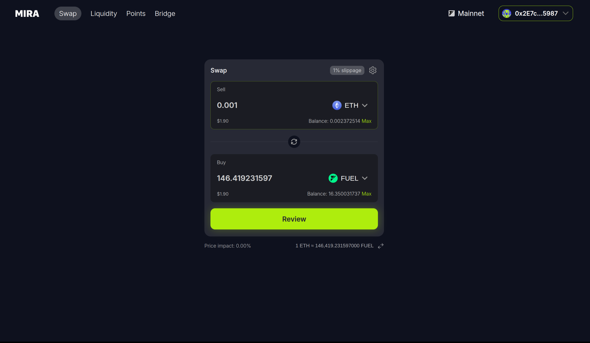
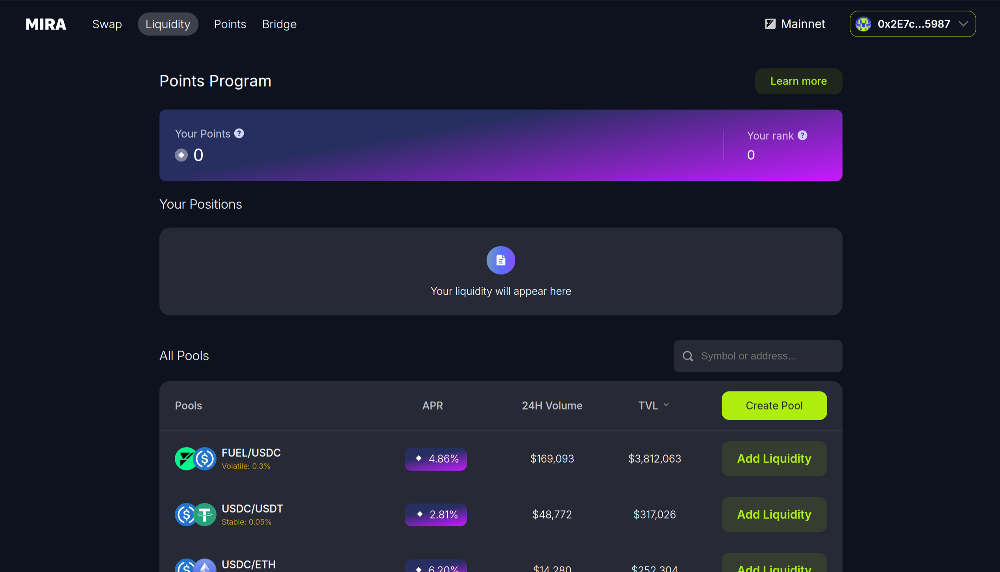
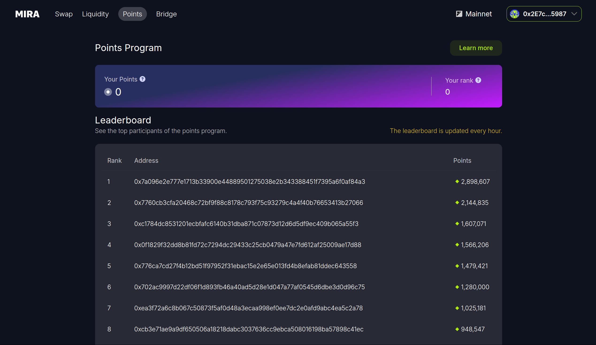
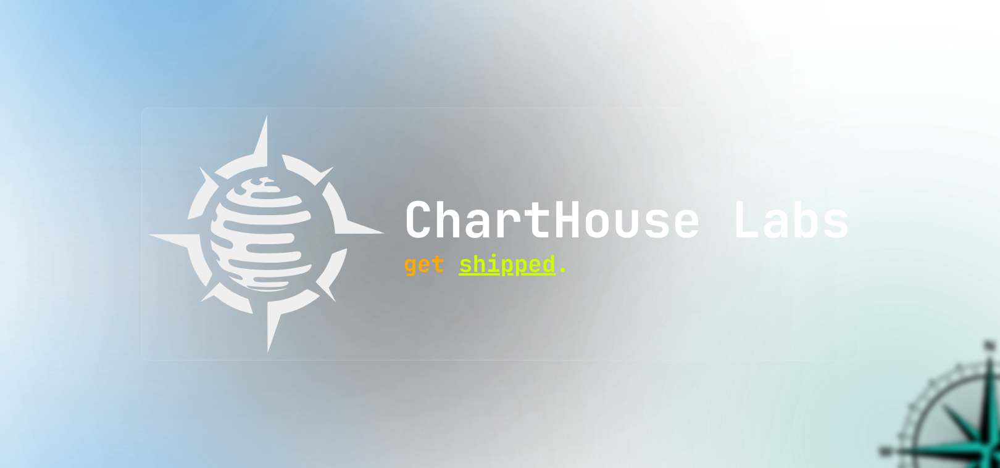

# mira-amm-web

Source code for the [Mira Exchange](https://mira.ly/) web interface that enables users to interact with the Mira decentralized exchange (DEX) on
the [Fuel blockchain](https://fuel.network/).

## Features

| [Swap Tokens](https://mira.ly) | [Manage Liquidity](https://mira.ly/liquidity/?page=1) | [Earn Points](https://mira.ly/points/) |
|-|-|-|
|  |  |  |

## Resources

- [Dex](https://mira.ly/)
- [Docs](https://docs.mira.ly/)
- [Core Contract](https://github.com/mira-amm/mira-v1-core)
- [Periphery Scripts](https://github.com/mira-amm/mira-v1-periphery)
- [TypeScript SDK](https://github.com/mira-amm/mira-v1-ts)
- [Rust SDK](https://github.com/mira-amm/mira-v1-rs)

## Installation

Up-to-date instructions can be found on the [docs](https://docs.mira.ly/installation).

### Maintained with 💙 by [ChartHouse Labs](https://www.charthouse.io) 🔱

