<h1 align="center">
  <a href="https://mira.ly">
   🟩 Mira 🦕
  </a>
</h1>

  🚧 Major Monorepo Migration in Progress 🏗

    
    
    <!-- <a href="https://github.com/mira-amm/mira-amm-web/actions/workflows/test_e2e.yml"> -->
    <!--      -->
    <!-- </a> -->

# Introduction

Source code for the [Mira Exchange](https://mira.ly/) web interface that enables users to interact with the Mira decentralized exchange (DEX) on
the [Fuel blockchain](https://fuel.network/).

## Features

### [Decentralized Exchange - (DEX)](https://mira.ly/)
| [Swap Tokens](https://mira.ly) | [Manage Liquidity](https://mira.ly/liquidity/?page=1) | [Earn Points](https://mira.ly/points/) |
|-|-|-|
|  |  |  |

## Platform

| [🪙 Decentralized Exchange - (DEX)](https://mira.ly/) | [📢 Website](https://mira.ly/landing) | [📚 Docs Site](https://docs.mira.ly) | [🌟 Design System - Storybook](https://design.mira.ly) | [🏛 Architecture](https://arch.mira.ly) |
| :-: | :-: | :-: | :-: | :-: |
|  | 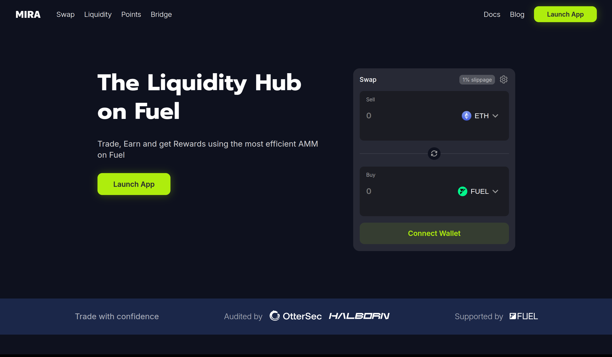 | 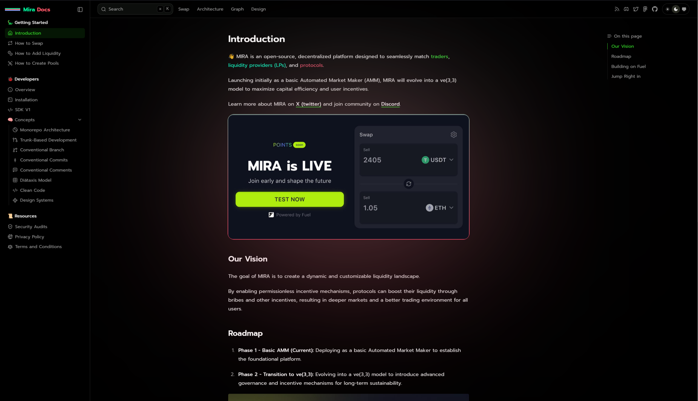 | 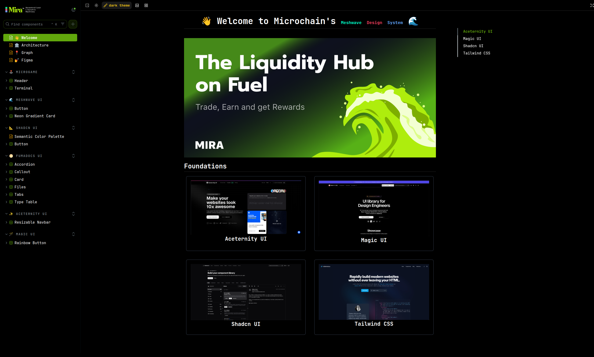 | 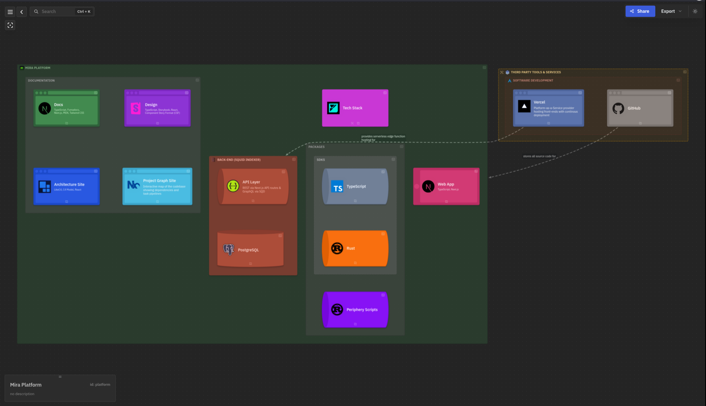 |

- [Core Contract](https://github.com/mira-amm/mira-v1-core)
- [Periphery Scripts](https://github.com/mira-amm/mira-v1-periphery)
- [TypeScript SDK](https://github.com/mira-amm/mira-v1-ts)
- [Rust SDK](https://github.com/mira-amm/mira-v1-rs)
- [Blog](https://mirror.xyz/miraly.eth)

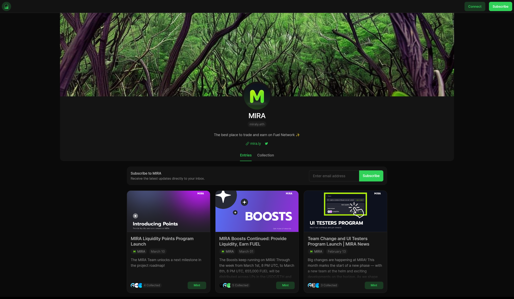

## Contributing

Developers are treated as first-class citizens here. The Mira platform's robust suite of tools handle the majority of environment setup, providing an outstanding full-stack development experience. 

The codebase is self-documenting.

| 🖥️ Microvisor | 💊 Microdoctor | [📍 Project Graph](https://mira.ly/landing) |
| :-: | :-: | :-: |
| 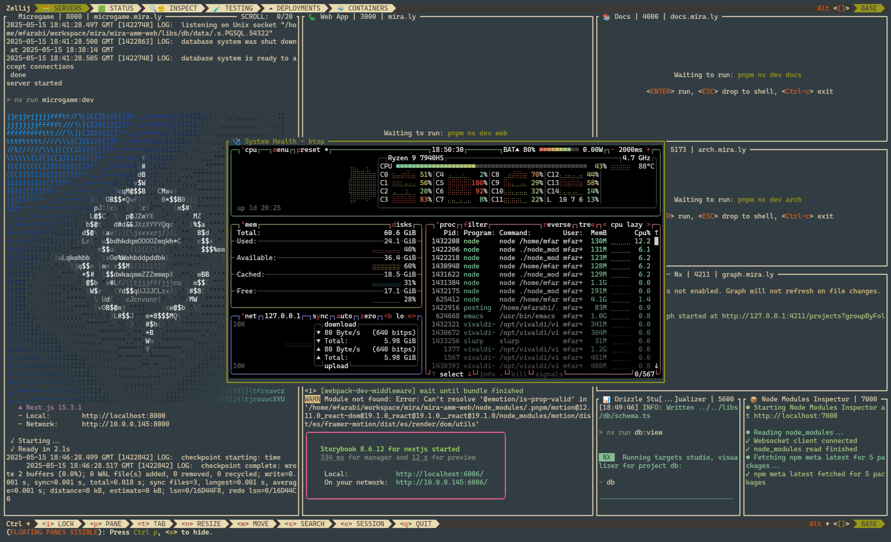 | 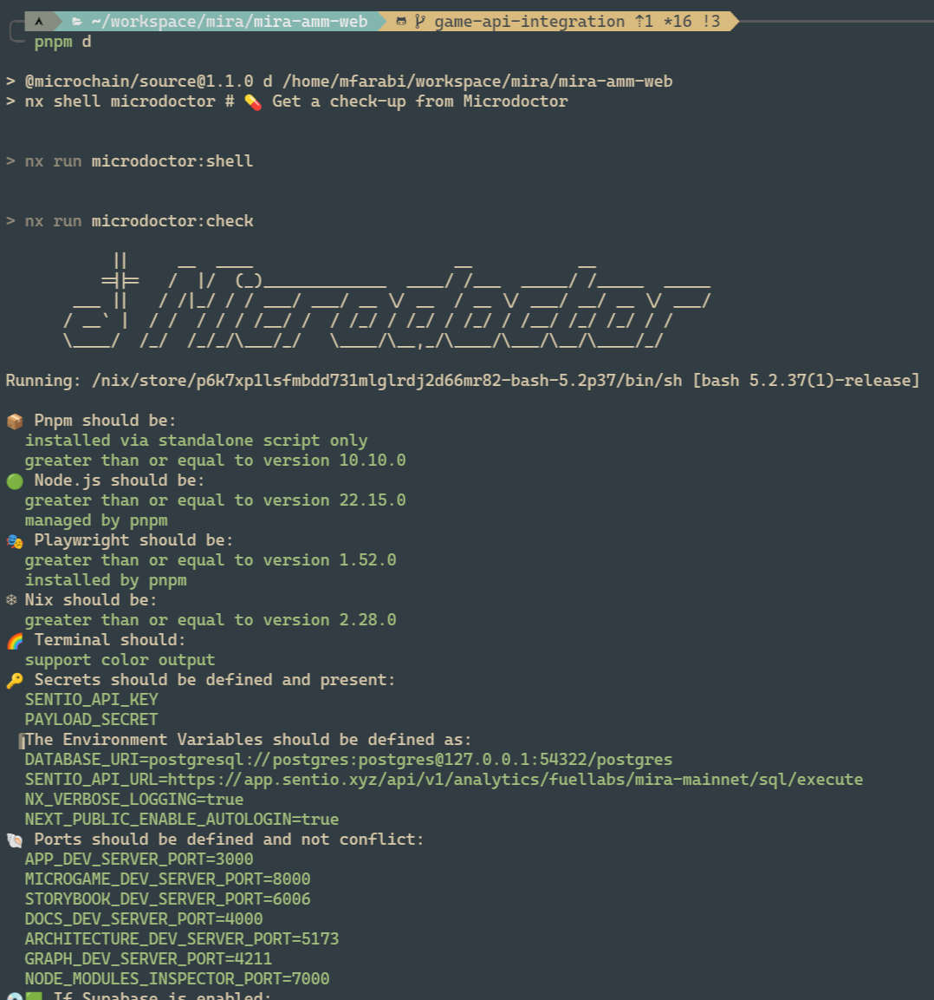 | 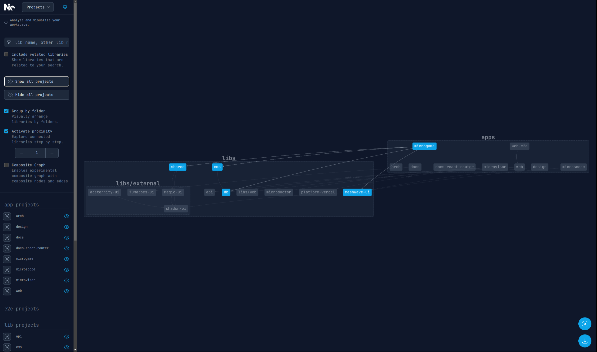 |

| Drizzle Studio | Drizzle Schema Visualizer |
| :-: | :-: |
| 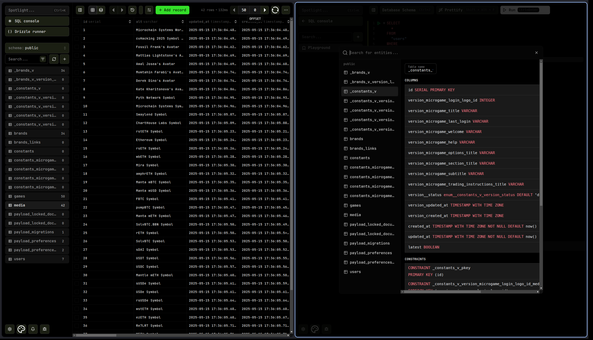 | 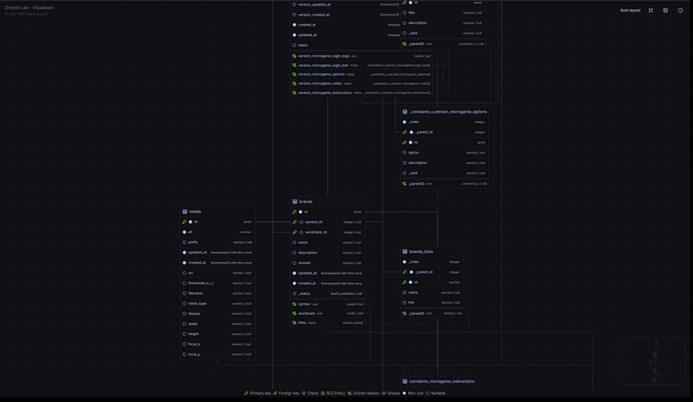 |

- OpenAPI Support

| JSON Endpoint | Swagger | Redoc | Rapidoc | Fumadocs | 
| :-: | :-: | :-: | :-: | :-: |
| 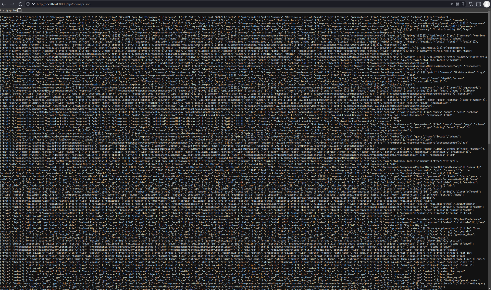 | 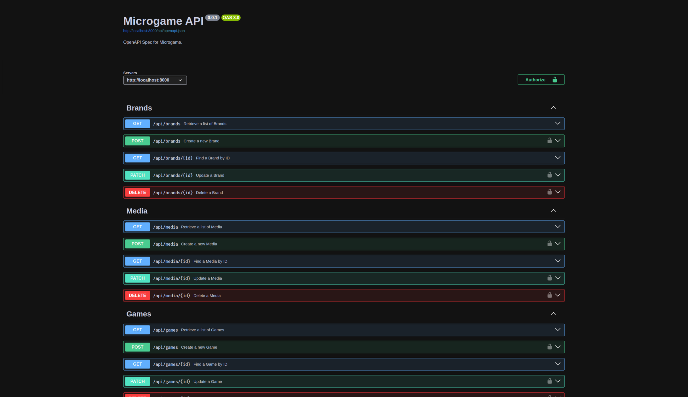 | 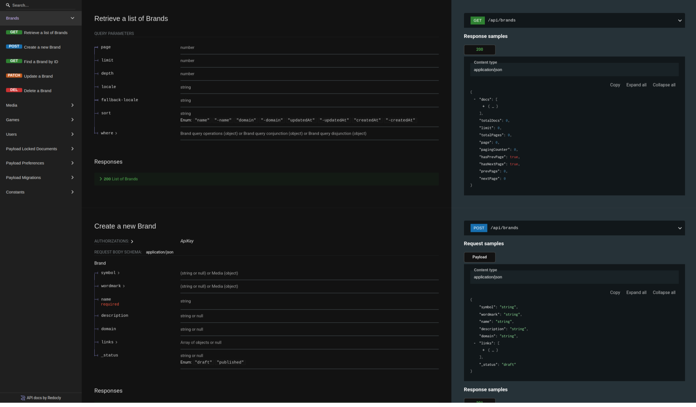 | 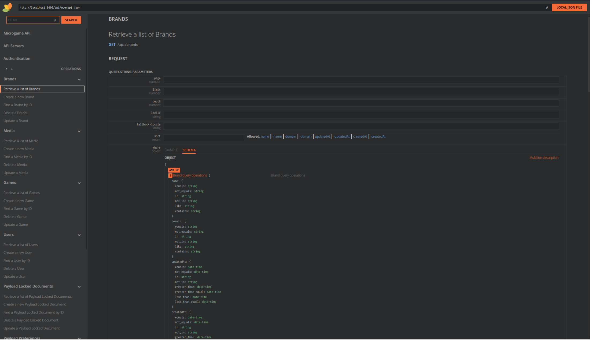 | 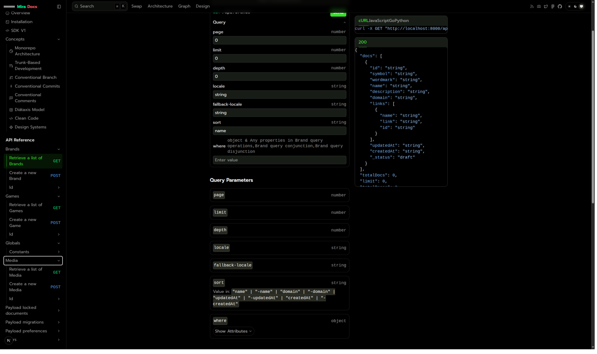 |

See [docs](https://docs.mira.ly/libraries/contributing/installation) for instructions.

## Socials/Contact
- [Twitter/X - @MiraProtocol](https://x.com/MiraProtocol)
- [Discord](https://discord.gg/6pHdTY6rYq)

## Acknowledgements & Ecosystem

| [Fuel](https://fuel.network) | [Swaylend](https://swaylend.com) |
|-|-|
| 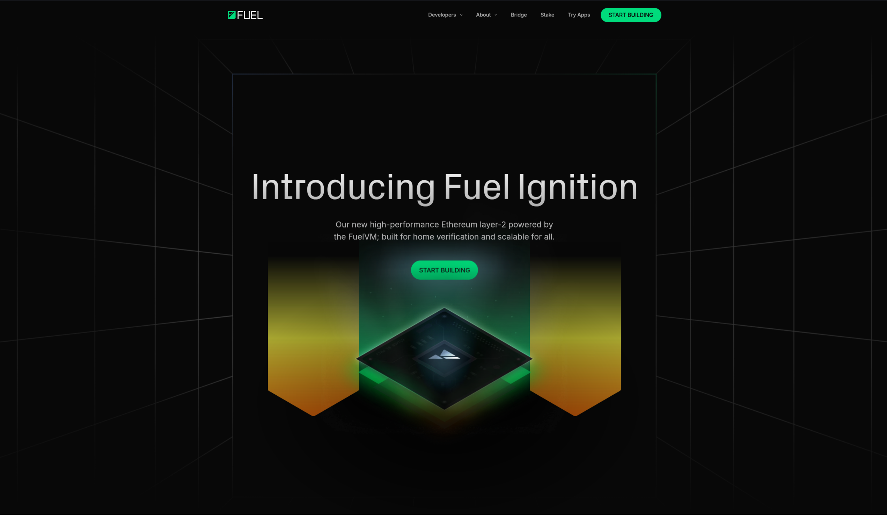 | 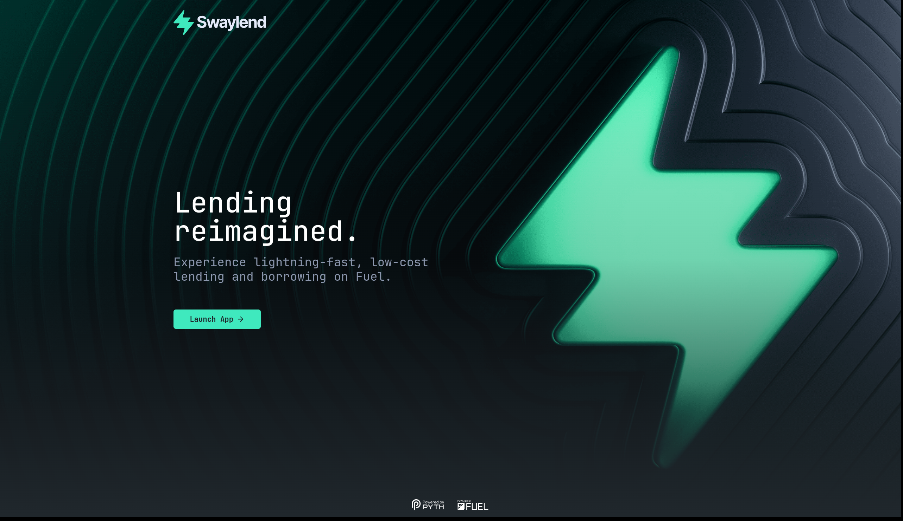 | 

Many of the monorepo scaffolding foundations have been inspired by, and brought over from [cuHacking](https://docs.cuhacking.ca)'s Axiom framework. 💚

### Maintained with 💙 by Open-Source @ [ChartHouse Labs](https://www.charthouse.io) 🔱

