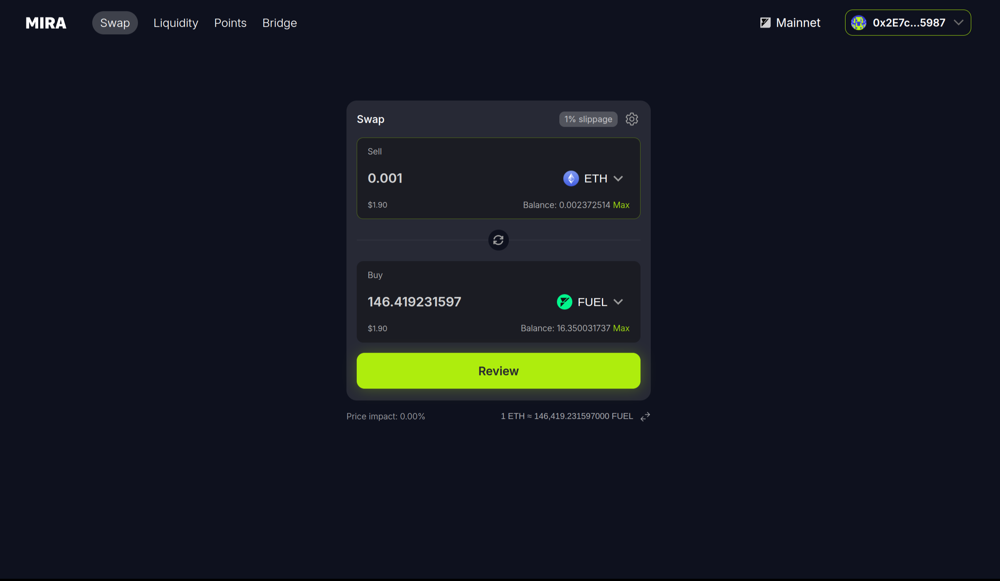
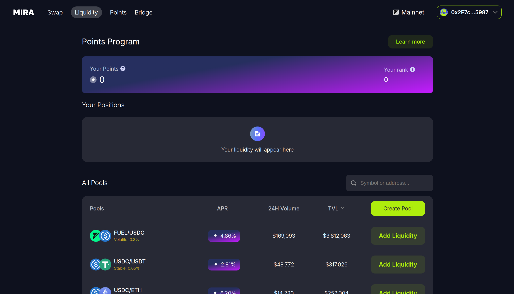
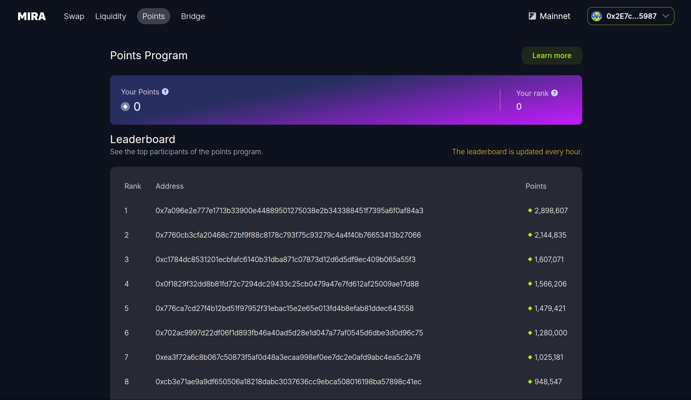
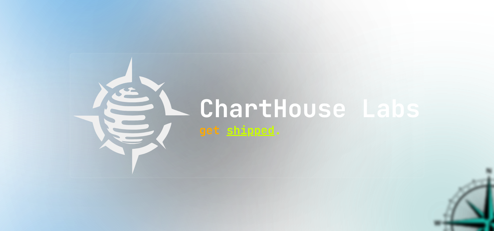

# mira-amm-web


Source code for the [Mira Exchange](https://mira.ly/) web interface that enables users to interact with the Mira decentralized exchange (DEX) on
the [Fuel blockchain](https://fuel.network/).

## Features

| [Swap Tokens](https://mira.ly) | [Manage Liquidity](https://mira.ly/liquidity/?page=1) | [Earn Points](https://mira.ly/points/) |
|-|-|-|
|  |  |  |

## Resources

- [Dex](https://mira.ly/)
- [Docs](https://docs.mira.ly/)
- [Core Contract](https://github.com/mira-amm/mira-v1-core)
- [Periphery Scripts](https://github.com/mira-amm/mira-v1-periphery)
- [TypeScript SDK](https://github.com/mira-amm/mira-v1-ts)
- [Rust SDK](https://github.com/mira-amm/mira-v1-rs)

## Installation

Microvisor

### Clone Repo

HTTPS:

```shell
https://github.com/mira-amm/mira-amm-web.git # HTTPS
```

Or

```shell
git@github.com:mira-amm/mira-amm-web.git # SSH
```

Or

```shell
gh repo clone mira-amm/mira-amm-web # GitHub CLI
```

### Install dependencies

```shell
pnpm i
```

```shell
pnpm exec playwright install
```

### Obtain environment variables

```shell
cp .env.example .env
```

Fill in all missing API keys and access tokens.

### Run dev server

```shell
pnpm dev
```

### Run End-to-End tests

```shell
pnpm test:e2e # UI mode
```

```shell
pnpm test:e2e-ci # Headless mode
```

### Maintained with 💙 by [ChartHouse Labs](https://www.charthouse.io) 🔱


