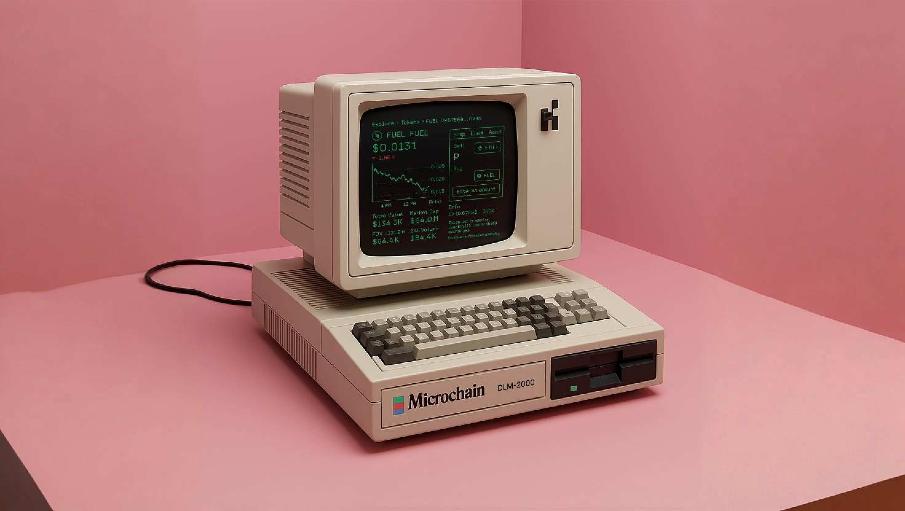

<h1 align="center">
  <a href="https://microchain.systems">
   🟩 Microchain 🦕
  </a>
</h1>

   

    
    
    <!-- <a href="https://github.com/mira-amm/mira-amm-web/actions/workflows/test_e2e.yml"> -->
    <!--      -->
    <!-- </a> -->

# Introduction

Source code for the [Microchain](https://microchain.systems) web interface that enables users to interact
with the Mira decentralized exchange (DEX) on the [Fuel blockchain](https://fuel.network/).

## Features

### [Decentralized Exchange - (DEX)](https://microchain.systems)

| [Swap Tokens](https://microchain.systems)                               | [Manage Liquidity](https://microchain.systems/liquidity/?page=1)          | [Earn Points](https://microchain.systems/points/)                     |
| ------------------------------------------------------------ | -------------------------------------------------------------- | ---------------------------------------------------------- |
|  |  |  |

## Platform

| [🪙 Decentralized Exchange - (DEX)](https://microchain.systems)            |           [📚 Docs Site](https://docs.microchain.systems)           |  [🌟 Design System - Storybook](https://design.microchain.systems)  |               [🏛 Architecture](https://arch.microchain.systems)               |
| :---------------------------------------------------: | :--------------------------------------------------------------: | :------------------------------------------------------: | :------------------------------------------------------: | :-----------------------------------------------------------------: |
|      |  |  |  |

- [Periphery Scripts](https://github.com/mira-amm/mira-v1-periphery)
- [Blog](https://mirror.xyz/0xBE101110E07430Cf585123864a55f51e53ABc339)

## Contributing

Developers are treated as first-class citizens here. Microchain's robust suite of tools
handle the majority of environment setup, providing an outstanding full-stack development
experience.

The codebase is self-documenting.

|                           🖥️ Microvisor                           |                        💊 Microdoctor                        |           [📍 Project Graph](https://microchain.systems/landing)            |
| :---------------------------------------------------------------: | :----------------------------------------------------------: | :--------------------------------------------------------------: |
|  |  |  |

|                           Drizzle Studio                           |                                Drizzle Schema Visualizer                                 |
| :----------------------------------------------------------------: | :--------------------------------------------------------------------------------------: |
|  |  |

- OpenAPI Support

|                          JSON Endpoint                          |                                Swagger                                |                               Redoc                               |                                Rapidoc                                |                                Fumadocs                                 |
| :-------------------------------------------------------------: | :-------------------------------------------------------------------: | :---------------------------------------------------------------: | :-------------------------------------------------------------------: | :---------------------------------------------------------------------: |
|  |  |  |  |  |

See [docs](https://docs.microchain.systems/libraries/contributing/installation) for instructions.

## Socials/Contact

- [Twitter/X - @MiraProtocol](https://x.com/MicrochainDLM/)
- [Discord](https://discord.gg/6pHdTY6rYq)

## Acknowledgements & Ecosystem

| [Fuel](https://fuel.network)                                   | [Swaylend](https://swaylend.com)                                       |
| -------------------------------------------------------------- | ---------------------------------------------------------------------- |
|  |  |

Many of the monorepo scaffolding foundations have been inspired by, and brought over from
[cuHacking](https://docs.cuhacking.ca)'s Axiom framework. 💚

### Maintained with 💙 by Open-Source @ [ChartHouse Labs](https://www.charthouse.io) 🔱

