# Indexer Schema V2 ERD - Liquidity Book Support

This document provides an Entity Relationship Diagram for the GraphQL schema used in the Mira AMM indexer V2, with support for liquidity book pools (based on Meteora/Joe V2 model) while maintaining backwards compatibility with V1.

## Field Requirements Legend
- **"required"**: Field must always be present and non-null
- **"optional"**: Field may be null or absent
- **"optional, V1 only"**: Field only applies to V1 pools, null for V2
- **"optional, V2 only"**: Field only applies to V2 pools, null for V1

```mermaid
erDiagram
    Asset {
        ID id PK "required"
        String contractId "optional"
        String subId "optional"
        String name "optional"
        String symbol "optional"
        Int decimals "optional"
        BigInt supply "required"
        String l1Address "optional"
        String image "optional"
        Int numPools "required"
        BigInt tradeVolume "required"
        String tradeVolumeDecimal "required"
        String price "required"
    }

    Pool {
        ID id PK "required"
        ID asset0 FK "required"
        ID asset1 FK "required"
        Boolean isStable "required"
        Boolean isLiquidityBook "optional, V2 only"
        ID lpToken FK "required, V1 only"
        BigInt reserve0 "required"
        BigInt reserve1 "required"
        String reserve0Decimal "required"
        String reserve1Decimal "required"
        Float tvlUSD "required"
        String price0 "required"
        String price1 "required"
        BigInt volumeAsset0 "required"
        BigInt volumeAsset1 "required"
        String volumeAsset0Decimal "required"
        String volumeAsset1Decimal "required"
        Float volumeUSD "required"
        String feesUSD "required"
        Int creationBlock "required"
        Int creationTime "required"
        String creationTx "required"
        Int protocolVersion "required"
        Int activeBinId "optional, V2 only"
        Int binStep "optional, V2 only"
        Float basePrice "optional, V2 only"
        BigInt globalLiquidity "optional, V2 only"
        Float baseFee "optional, V2 only"
        Float volatilityFee "optional, V2 only"
    }

    Bin {
        ID id PK "required"
        ID pool FK "required"
        Int binId "required"
        BigInt reserveX "required"
        BigInt reserveY "required"
        String reserveXDecimal "required"
        String reserveYDecimal "required"
        BigInt liquidity "required"
        BigInt totalSupply "required"
        Float price "required"
        Float pricePerToken "optional"
        Boolean isActive "required"
        Float tvlUSD "optional"
        BigInt accTokenXPerShare "required"
        BigInt accTokenYPerShare "required"
        Int lastUpdateBlock "required"
        Int lastUpdateTime "required"
    }

    Position {
        ID id PK "required"
        ID pool FK "required"
        String nftAssetId "required"
        Int creationBlock "required"
        Int creationTime "required"
        String creationTx "required"
        Int lastUpdateBlock "required"
        Int lastUpdateTime "required"
        Boolean isClosed "required"
    }

    BinPosition {
        ID id PK "required"
        ID position FK "required"
        ID bin FK "required"
        BigInt liquidityShares "required"
        BigInt positionReserveX "required"
        BigInt positionReserveY "required"
        String positionReserveXDecimal "required"
        String positionReserveYDecimal "required"
        BigInt feesX "required"
        BigInt feesY "required"
        Float positionTvlUSD "optional"
        Int lastUpdateBlock "required"
        Int lastUpdateTime "required"
    }

    Action {
        ID id PK "required"
        Int blockNumber "required"
        Int timestamp "required"
        String transaction "required"
        Type type "required"
        ID pool FK "required"
        String recipient "required"
        ID asset0 FK "required"
        ID asset1 FK "required"
        BigInt amount0In "required"
        BigInt amount1In "required"
        BigInt amount0Out "required"
        BigInt amount1Out "required"
        BigInt reserves0Before "required"
        BigInt reserves1Before "required"
        BigInt reserves0After "required"
        BigInt reserves1After "required"
        ID position FK "optional, V2 only"
        Int[] binIds "optional, V2 only"
        BigInt[] liquidityDeltas "optional, V2 only"
        Int activeBinBefore "optional, V2 only"
        Int activeBinAfter "optional, V2 only"
        Float priceBefore "optional, V2 only"
        Float priceAfter "optional, V2 only"
    }

    PoolHourlySnapshot {
        ID id PK "required"
        ID pool FK "required"
        Int timestamp "required"
        BigInt reserve0 "required"
        BigInt reserve1 "required"
        String reserve0Decimal "required"
        String reserve1Decimal "required"
        Float tvlUSD "required"
        BigInt volumeAsset0 "required"
        BigInt volumeAsset1 "required"
        String volumeAsset0Decimal "required"
        String volumeAsset1Decimal "required"
        Float volumeUSD "required"
        String feesUSD "required"
        String price0 "required"
        String price1 "required"
        Int activeBinId "optional, V2 only"
        BigInt globalLiquidity "optional, V2 only"
    }

    LiquidityDistribution {
        ID id PK "required"
        ID pool FK "required"
        Int timestamp "required"
        Int binId "required"
        BigInt liquidity "required"
        BigInt totalSupply "required"
        Float price "required"
        Float percentageOfTotal "required"
        BigInt reserveX "required"
        BigInt reserveY "required"
    }

    BinSnapshot {
        ID id PK "required"
        ID bin FK "required"
        ID poolSnapshot FK "required"
        Int timestamp "required"
        BigInt reserveX "required"
        BigInt reserveY "required"
        BigInt liquidity "required"
        BigInt totalSupply "required"
        Float price "required"
        BigInt volumeX "required"
        BigInt volumeY "required"
        BigInt feesX "required"
        BigInt feesY "required"
    }

    Pool ||--o{ Bin : "has bins"
    Pool ||--o{ Position : "has positions"
    Pool ||--o{ PoolHourlySnapshot : "has snapshots"
    Pool ||--o{ LiquidityDistribution : "has distribution"
    Pool }o--|| Asset : "asset0"
    Pool }o--|| Asset : "asset1"
    Pool }o--|| Asset : "lpToken"
    Bin }o--|| Pool : "belongs to"
    Bin ||--o{ BinSnapshot : "has snapshots"
    Bin ||--o{ BinPosition : "has positions"
    Position }o--|| Pool : "belongs to"
    Position ||--o{ BinPosition : "has bin positions"
    BinPosition }o--|| Position : "belongs to position"
    BinPosition }o--|| Bin : "belongs to bin"
    Action }o--|| Pool : "involves"
    Action }o--|| Asset : "asset0"
    Action }o--|| Asset : "asset1"
    Action }o--o| Position : "modifies"
    PoolHourlySnapshot }o--|| Pool : "snapshots"
    PoolHourlySnapshot ||--o{ BinSnapshot : "has bin snapshots"
    LiquidityDistribution }o--|| Pool : "describes"
    BinSnapshot }o--|| Bin : "snapshots"
    BinSnapshot }o--|| PoolHourlySnapshot : "belongs to pool snapshot"
```



## Entity Descriptions

### Existing Entities (V1 Compatible)

#### Asset
Represents a tradeable asset/token in the system with metadata like name, symbol, decimals, and trading statistics. Unchanged from V1.

#### Pool
Enhanced liquidity pool entity supporting both V1 pools and V2 liquidity book pools.

**New fields for V2:**
- `isLiquidityBook`: Boolean flag indicating if this is a liquidity book pool
- `protocolVersion`: Integer (1 or 2) indicating the protocol version *(Note: Making this required will require re-indexing existing V1 pools)*
- `activeBinId`: Current active bin ID where trading occurs
- `binStep`: The price step between consecutive bins (basis points)
- `basePrice`: Initial price for bin calculations
- `globalLiquidity`: Total liquidity across all bins
- `baseFee`: Base fee rate for the pool
- `volatilityFee`: Current volatility-adjusted fee

**Backwards compatibility:**
- All V1 fields remain unchanged
- V1 pools have `isLiquidityBook = false` and `protocolVersion = 1`
- Liquidity book specific fields are null for V1 pools

#### Action
Enhanced to record liquidity book specific actions.

**New fields for V2:**
- `position`: Reference to position for liquidity book actions
- `binIds`: Array of bin IDs affected by the action
- `liquidityDeltas`: Array of liquidity changes per bin
- `activeBinBefore`: Active bin ID before the action
- `activeBinAfter`: Active bin ID after the action
- `priceBefore`: Price before the action
- `priceAfter`: Price after the action

**New action types:**
- `ADD_LIQUIDITY_V2`: Adding liquidity to specific bins
- `REMOVE_LIQUIDITY_V2`: Removing liquidity from specific bins
- `COLLECT_FEES`: Collecting accumulated fees from a position
- `SWAP_V2`: Swap in liquidity book pool

#### PoolHourlySnapshot
Enhanced with liquidity book metrics.

**New fields for V2:**
- `activeBinId`: Active bin ID at snapshot time
- `globalLiquidity`: Total liquidity at snapshot time

### New Entities (V2 Specific)

#### Bin
Represents a liquidity bin in liquidity book pools. Each bin represents a discrete price level.

**Fields:**
- `id`: Unique identifier
- `pool`: Reference to the pool
- `binId`: Numeric bin identifier (price level)
- `reserveX`: Token X reserves in this bin
- `reserveY`: Token Y reserves in this bin
- `liquidity`: Active liquidity in this bin
- `totalSupply`: Total LP tokens for this bin
- `price`: Price at this bin level
- `pricePerToken`: Price per LP token
- `isActive`: Whether this is the current active bin
- `tvlUSD`: Total value locked in USD
- `accTokenXPerShare`: Accumulated token X per share (for fee distribution)
- `accTokenYPerShare`: Accumulated token Y per share (for fee distribution)
- `lastUpdateBlock`: Last update block number
- `lastUpdateTime`: Last update timestamp

#### Position
Represents an NFT-based liquidity position in a liquidity book pool. Each position is represented by a unique NFT with its own asset ID. Note: Owner tracking is not included as NFT ownership transfers cannot be reliably indexed.

**Fields:**
- `id`: Unique position identifier
- `pool`: Reference to the pool
- `nftAssetId`: Unique asset ID of the NFT representing this position
- `creationBlock`: Block when position NFT was minted
- `creationTime`: Timestamp when position was created
- `creationTx`: Transaction hash of creation
- `lastUpdateBlock`: Last modification block
- `lastUpdateTime`: Last modification timestamp
- `isClosed`: Whether the position has been fully withdrawn

#### BinPosition
Represents the liquidity shares owned by a Position NFT in a specific bin. Uses internal ERC20-like accounting where the NFT is the "owner" of liquidity shares in each bin.

**Fields:**
- `id`: Unique identifier
- `position`: Reference to the Position NFT
- `bin`: Reference to the specific bin
- `liquidityShares`: Amount of liquidity shares owned in this bin
- `positionReserveX`: Token X reserves attributed to this specific position in this bin
- `positionReserveY`: Token Y reserves attributed to this specific position in this bin
- `positionReserveXDecimal`: Decimal representation of position's token X reserves
- `positionReserveYDecimal`: Decimal representation of position's token Y reserves
- `feesX`: Accumulated fees in token X for this bin position
- `feesY`: Accumulated fees in token Y for this bin position
- `positionTvlUSD`: Value locked by this specific position in this bin (USD)
- `lastUpdateBlock`: Last modification block
- `lastUpdateTime`: Last modification timestamp

#### LiquidityDistribution
Represents the current liquidity distribution across bins for liquidity book pools.

**Fields:**
- `id`: Unique identifier
- `pool`: Reference to the pool
- `timestamp`: Time of the distribution snapshot
- `binId`: Bin identifier
- `liquidity`: Liquidity in this bin
- `totalSupply`: Total LP token supply for this bin
- `price`: Price at this bin
- `percentageOfTotal`: Percentage of total pool liquidity in this bin
- `reserveX`: Token X reserves in this bin
- `reserveY`: Token Y reserves in this bin

#### BinSnapshot
Historical snapshots of individual bin states, linked to pool-level snapshots for consistency.

**Fields:**
- `id`: Unique identifier
- `bin`: Reference to the bin
- `poolSnapshot`: Reference to the corresponding pool hourly snapshot
- `timestamp`: Snapshot timestamp
- `reserveX`: Token X reserves at snapshot
- `reserveY`: Token Y reserves at snapshot
- `liquidity`: Liquidity at snapshot
- `totalSupply`: LP token supply at snapshot
- `price`: Price at snapshot
- `volumeX`: Volume of token X traded
- `volumeY`: Volume of token Y traded
- `feesX`: Fees collected in token X
- `feesY`: Fees collected in token Y

## Relationships

### Existing Relationships (V1)
- **Pool → Asset**: Each pool references three assets (asset0, asset1, and lpToken)
- **Pool → PoolHourlySnapshot**: One-to-many relationship for historical snapshots
- **Action → Pool**: Each action is associated with a specific pool
- **Action → Asset**: Each action involves two assets

### New Relationships (V2)
- **Pool → Bin**: One-to-many relationship for liquidity bins (liquidity book pools only)
- **Pool → Position**: One-to-many relationship for position NFTs
- **Pool → LiquidityDistribution**: One-to-many relationship for distribution snapshots
- **PoolHourlySnapshot → BinSnapshot**: One-to-many relationship for bin snapshots at the same time
- **Bin → Pool**: Each bin belongs to a specific pool
- **Bin → BinSnapshot**: One-to-many relationship for bin historical data
- **Bin → BinPosition**: One-to-many relationship for positions in this bin
- **Position → Pool**: Each position NFT belongs to a specific pool
- **Position → BinPosition**: One-to-many relationship for bin-specific liquidity shares
- **BinPosition → Position**: Each bin position belongs to a Position NFT
- **BinPosition → Bin**: Each bin position belongs to a specific bin
- **Action → Position**: Actions can modify positions (for liquidity book)
- **LiquidityDistribution → Pool**: Distribution data belongs to a pool
- **BinSnapshot → Bin**: Historical snapshots belong to a bin
- **BinSnapshot → PoolHourlySnapshot**: Each bin snapshot belongs to a pool snapshot

## Action Types

### V1 Action Types (Maintained)
- `ADD_LIQUIDITY`: Adding liquidity to a V1 pool
- `REMOVE_LIQUIDITY`: Removing liquidity from a V1 pool
- `SWAP`: Token swap in V1 pool

### V2 Action Types (New)
- `ADD_LIQUIDITY_V2`: Adding liquidity to specific bins
- `REMOVE_LIQUIDITY_V2`: Removing liquidity from specific bins
- `COLLECT_FEES`: Collecting fees from a position
- `SWAP_V2`: Swap in liquidity book pool
- `UPDATE_POSITION`: Modifying an existing position
- `REBALANCE`: Rebalancing liquidity across bins

## Query Examples

### Get Current Liquidity Distribution
```graphql
query GetLiquidityDistribution($poolId: ID!) {
  pool(id: $poolId) {
    id
    isLiquidityBook
    activeBinId
    binStep
    liquidityDistribution(orderBy: binId, orderDirection: asc) {
      binId
      liquidity
      totalSupply
      price
      percentageOfTotal
      reserveX
      reserveY
    }
    bins(where: { isActive: true }) {
      binId
      price
      liquidity
      totalSupply
      tvlUSD
    }
  }
}
```

### Get Position Details by NFT Asset ID
```graphql
query GetPositionByNFT($nftAssetId: String!) {
  positions(where: { nftAssetId: $nftAssetId, isClosed: false }) {
    id
    nftAssetId
    pool {
      id
      asset0 { symbol }
      asset1 { symbol }
    }
    binPositions {
      bin {
        binId
        price
      }
      liquidityShares
      positionReserveXDecimal
      positionReserveYDecimal
      feesX
      feesY
      positionTvlUSD
    }
  }
}
```

### Get Detailed Position Information
```graphql
query GetDetailedPosition($nftAssetId: String!) {
  position(where: { nftAssetId: $nftAssetId }) {
    id
    nftAssetId
    pool {
      id
      asset0 { symbol, decimals }
      asset1 { symbol, decimals }
      activeBinId
    }
    binPositions {
      bin {
        binId
        price
        isActive
      }
      liquidityShares
      positionReserveX
      positionReserveY
      feesX
      feesY
      positionTvlUSD
    }
    creationTime
    lastUpdateTime
  }
}
```

### Get Pool Metrics (V1 and V2 Compatible)
```graphql
query GetPoolMetrics($poolId: ID!) {
  pool(id: $poolId) {
    id
    isStable
    isLiquidityBook
    protocolVersion
    reserve0Decimal
    reserve1Decimal
    tvlUSD
    volumeUSD
    feesUSD
    # V2 specific fields (null for V1 pools)
    activeBinId
    binStep
    globalLiquidity
    baseFee
    volatilityFee
  }
}
```

### Get Bin Liquidity Providers
```graphql
query GetBinLiquidityProviders($poolId: ID!, $binId: Int!) {
  binPositions(where: {
    bin: { pool: $poolId, binId: $binId },
    liquidityShares_gt: 0
  }) {
    position {
      nftAssetId
    }
    liquidityShares
    positionTvlUSD
  }
}
```

## Migration Notes

### Backwards Compatibility
1. All V1 queries continue to work without modification
2. V1 pools have `isLiquidityBook = false` and `protocolVersion = 1`
3. V2-specific fields return null for V1 pools
4. Existing integrations can gradually adopt V2 features

**⚠️ Migration Note:** Making `protocolVersion` a required field will require re-indexing all existing V1 pools to populate this field with the value `1`. This ensures data consistency and enables reliable protocol version detection across all pools.

### Price Calculation Differences
- **V1 Pools**: Price calculated as `reserve1 / reserve0` (constant product or stable curve)
- **V2 Liquidity Book Pools**:
  - Each bin represents a discrete price level
  - Price = `basePrice * (1 + binStep/10000)^binId`
  - Active trading occurs only in the active bin
  - Price moves discretely between bins

### Liquidity Representation
- **V1 Pools**: Single liquidity value across entire price range
- **V2 Liquidity Book Pools**:
  - Liquidity concentrated in discrete bins
  - Each bin acts as a constant product pool
  - Positions represented by NFTs owning shares across multiple bins
  - Internal ERC20-like accounting for bin liquidity shares

### Position Management
- **V1 Pools**: Direct LP token ownership
- **V2 Liquidity Book Pools**:
  - Positions represented by unique NFTs (with asset IDs)
  - Each NFT owns liquidity shares in multiple bins
  - Transferable positions via NFT transfers
  - Aggregated fee collection across all bins
  - **Note**: NFT ownership is not tracked in the indexer as transfers cannot be reliably detected

### Fee Handling
- **V1 Pools**: Fixed fee tiers (0.3% for volatile, 0.04% for stable)
- **V2 Liquidity Book Pools**:
  - Dynamic fee rates: `baseFee + volatilityFee`
  - Fees accumulated per bin
  - Fee distribution proportional to liquidity shares
  - Total fees earned tracked per position per bin

## Performance Considerations

### Indexing Strategy
1. **Bin Data**: Only index bins with non-zero liquidity
2. **Position Tracking**: Index NFT ownership changes and bin position updates
3. **Liquidity Distribution**: Calculate and cache distribution periodically
4. **Fee Accumulation**: Update fee growth incrementally per bin

### Query Optimization
1. Use pagination for large position/bin queries
2. Aggregate bin positions by NFT for portfolio views
3. Pre-calculate TVL and fee metrics during indexing
4. Use materialized views for liquidity distribution charts
5. Index NFT asset IDs for fast position lookups

## Future Enhancements

### Planned V2.1 Features
- Range order support across multiple bins
- Limit order functionality using single-bin liquidity
- Advanced position analytics and P&L tracking
- Cross-pool position aggregation
- Impermanent loss calculation per bin range

### Potential V3 Features
- Multi-hop swap path optimization
- Portfolio management with NFT collections
- Automated rebalancing strategy tracking
- Liquidity mining reward distribution
- Cross-chain position mirroring
