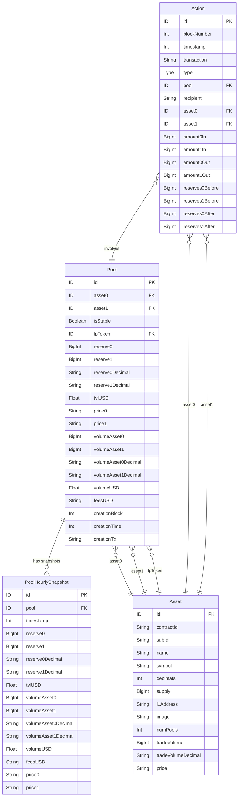

# Indexer Schema ERD

This document provides an Entity Relationship Diagram for the GraphQL schema used in the Mira AMM
indexer.

## Entity Descriptions

### Asset

Represents a tradeable asset/token in the system with metadata like name, symbol, decimals, and
trading statistics.

### Pool

Represents a liquidity pool containing two assets, tracking reserves, volumes, fees, and pricing
information.

### Action

Records all pool interactions including swaps, liquidity additions, and removals with before/after
state.

### PoolHourlySnapshot

Time-series data capturing pool state at hourly intervals for historical analysis.

## Relationships

- **Pool → Asset**: Each pool references three assets (asset0, asset1, and lpToken)
- **Pool → PoolHourlySnapshot**: One-to-many relationship for historical snapshots
- **Action → Pool**: Each action is associated with a specific pool
- **Action → Asset**: Each action involves two assets

## Action Types

The `Type` enum defines three types of pool actions:

- `ADD_LIQUIDITY`: Adding liquidity to a pool
- `REMOVE_LIQUIDITY`: Removing liquidity from a pool
- `SWAP`: Token swap transaction
