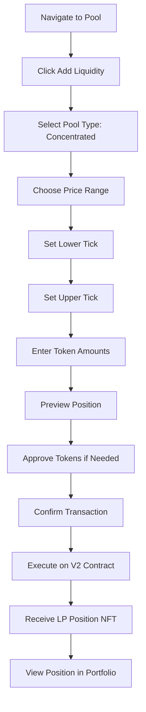
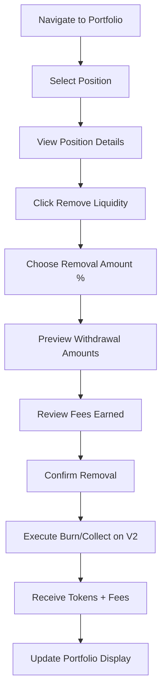
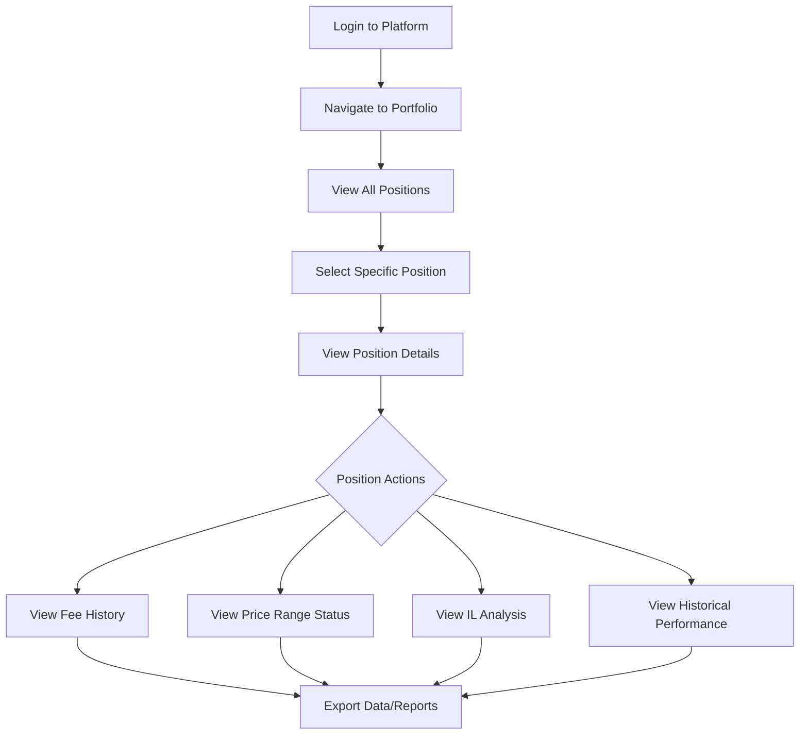
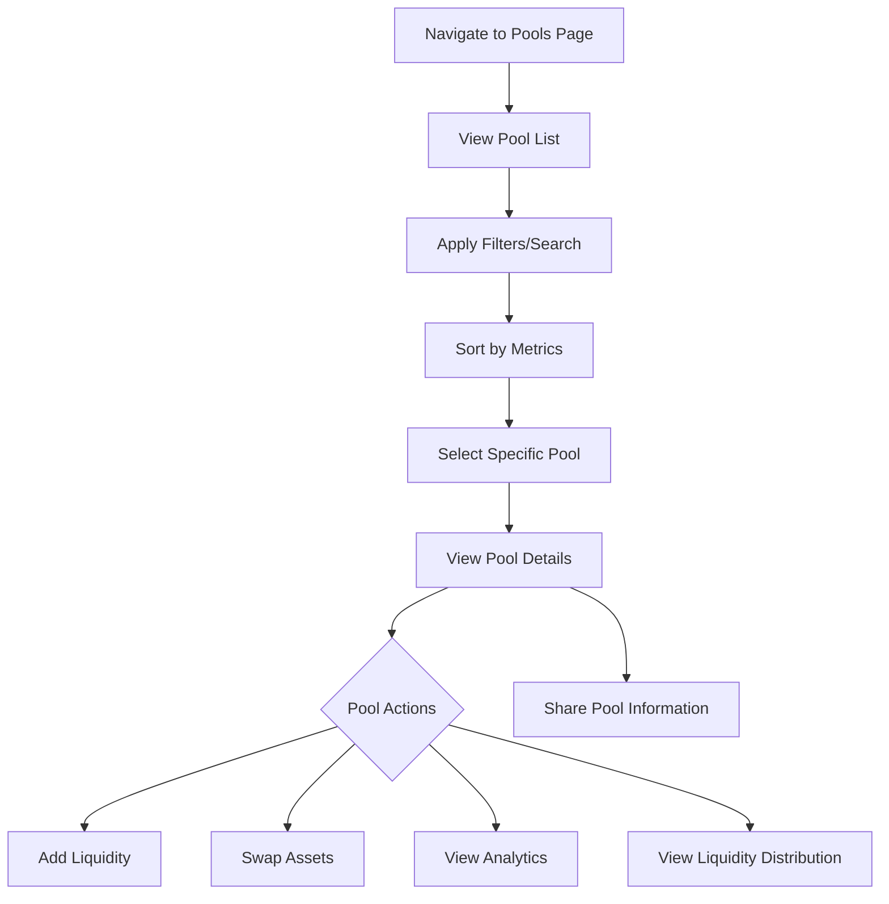
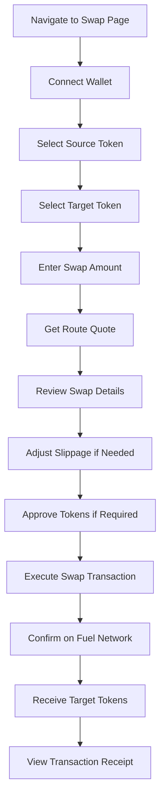

# User Stories - Mira AMM Platform

## Project Overview
A comprehensive Automated Market Maker (AMM) platform built on Fuel Network, featuring both traditional liquidity pools (V1) and concentrated liquidity (V2) for optimal capital efficiency. Targeting sophisticated traders and liquidity providers who need professional-grade DeFi tools with advanced features like routing optimization, concentrated liquidity management, and comprehensive portfolio tracking.

## Primary User Personas
- **Sophisticated Trader**: Experienced DeFi users who need optimal routing and minimal slippage for their trades across different pool types
- **Professional Liquidity Provider**: Advanced users who want to maximize yield through concentrated liquidity strategies and comprehensive position management
- **Institutional User**: Organizations requiring robust AMM infrastructure with detailed analytics and reporting capabilities

---

## Table of Contents
1. [Architecture EPIC](#architecture-epic)
2. [Cloud Infra EPIC](#cloud-infra-epic)
3. [Implementation EPIC](#implementation-epic)
   - [Add Concentrated Liquidity](#story-1-add-concentrated-liquidity)
   - [Remove Concentrated Liquidity](#story-2-remove-concentrated-liquidity)
   - [View Liquidity Position](#story-3-view-liquidity-position)
   - [View Pool Information](#story-4-view-pool-information)
   - [Execute Optimal Swap](#story-5-execute-optimal-swap)

---

## Architecture EPIC

### Task 1: Updated SDK Interface for Multiple Contract Types
**As a** development team
**I want** an updated SDK interface that handles different types of contracts (V1 Stable, V1 Volatile, V2 Concentrated)
**So that** we have a unified interface for interacting with all pool types and can abstract contract complexity from frontend developers

**Required Competencies:** TypeScript, SDK Architecture, Smart Contract Integration
**Project Areas:** SDK, Contract Integration, API Design

**Acceptance Criteria:**
- SDK interface abstracts V1 Stable, V1 Volatile, and V2 Concentrated liquidity contracts
- Type-safe interfaces for all contract methods and return types
- Automatic contract type detection based on pool address or metadata
- Unified error handling across different contract types
- Backward compatibility with existing V1 SDK methods
- Comprehensive TypeScript types and interfaces for all operations
- Support for batch operations across multiple contract types

### Task 2: Entity Relationship Diagram for Indexed Data Model
**As a** development team
**I want** a comprehensive ERD for the indexed data model that ensures backward compatibility
**So that** we can extend our data model for V2 features without breaking existing V1 functionality

**Required Competencies:** Data Modeling, Database Design, Subsquid
**Project Areas:** Indexer, Database, Data Architecture

**Acceptance Criteria:**
- Complete ERD showing all entities for V1 and V2 pool data
- Clear relationships between pools, positions, transactions, and users
- Backward compatible schema that doesn't break existing V1 queries
- Optimized for common query patterns (portfolio views, pool analytics, position tracking)
- Proper indexing strategy for performance at scale
- Migration path from current schema to new schema
- Documentation of all entity relationships and data types

### Task 3: Smart Contract Interfaces (ABIs) Documentation
**As a** development team
**I want** comprehensive documentation of all smart contract ABIs
**So that** SDK and frontend developers can integrate with contracts correctly and efficiently

**Required Competencies:** Smart Contract Development, Technical Documentation
**Project Areas:** Smart Contracts, Documentation, SDK Integration

**Acceptance Criteria:**
- Complete ABI documentation for V1 Stable Pool contracts
- Complete ABI documentation for V1 Volatile Pool contracts
- Complete ABI documentation for V2 Concentrated Liquidity contracts
- Factory contract ABIs for all pool types
- Event definitions and decoding specifications
- Error types and revert messages documentation
- Example usage patterns for common operations

---

## Implementation EPIC

### Story 1: Add Concentrated Liquidity

**As a** professional liquidity provider
**I want to** add liquidity to a specific price range in a concentrated liquidity pool
**So that** I can maximize capital efficiency and earn higher fees from my liquidity provision

#### User Flow Diagram

#### Task Flow
1. User navigates to a specific pool page from pool list
2. User clicks "Add Liquidity" button
3. System detects pool is V2 concentrated liquidity type
4. System displays price range selector interface
5. User sets minimum price (lower tick) for their liquidity range
6. User sets maximum price (upper tick) for their liquidity range
7. User enters amount for first token or uses balance percentage
8. System automatically calculates required amount of second token based on current pool ratio and selected range
9. System displays position preview showing:
   - Expected LP tokens/NFT to receive
   - Fee tier and estimated APR
   - Price range visualization
   - Capital efficiency compared to full-range position
10. User reviews and confirms token approvals if needed
11. User confirms the liquidity provision transaction
12. System executes mint function on V2 concentrated liquidity contract
13. Transaction is submitted to Fuel Network
14. User receives position NFT representing their concentrated liquidity position
15. Position appears in user's portfolio with real-time P&L tracking

#### Prerequisite Stories
- Pool list display functionality
- Wallet connection and authentication
- Token approval flow
- Portfolio/position management system

#### Prerequisite Technical Stories
- V2 concentrated liquidity contracts deployed
- Tick math library implementation
- Position NFT contract functionality
- Subsquid indexer for V2 pool data
- SDK V2 liquidity management functions

#### Subtasks

**Designs 1.1: Concentrated Liquidity Addition Interface Design**
- Required Competencies: UX/UI Design, Figma
- Project Areas: Design System, User Interface
- Description: Create comprehensive Figma designs for concentrated liquidity addition including interactive price range selector with tick visualization, position preview component showing expected LP NFT details and fee estimates, token input components with balance display and percentage selectors, and educational onboarding flow explaining concentrated liquidity concepts, risks, and benefits to users

**SDK 1.2: Concentrated Liquidity Position Management SDK**
- Required Competencies: TypeScript, Smart Contract Integration
- Project Areas: SDK, Contract Integration
- Description: Build comprehensive SDK functions for concentrated liquidity business logic including V2 position minting with tick calculations and NFT handling, sophisticated price range and tick calculation utilities with capital efficiency metrics and validation, token approval workflow with batch approvals and gas optimization, position preview calculation engine with expected token amounts and fee projections, real-time position validation and boundary checks, and comprehensive error handling for all edge cases with detailed error messages

**Front-End 1.3: Concentrated Liquidity Addition Components**
- Required Competencies: React, TypeScript, Frontend Development
- Project Areas: Frontend, Components
- Description: Implement UI components that consume SDK functions including interactive price range selector component calling SDK tick calculation functions, position preview component displaying SDK calculation results with real-time updates, dual-token input component with SDK balance validation and automatic ratio calculations, integrated liquidity addition flow consuming SDK approval and minting functions, transaction state management using SDK transaction handlers, and comprehensive error display using SDK error messaging system

**Indexer 1.4: Concentrated Liquidity Data Pipeline**
- Required Competencies: Subsquid, Database Design, Data Modeling
- Project Areas: Indexer, Data Pipeline
- Description: Implement complete concentrated liquidity indexer including V2 pool state tracking with tick updates and position events, position NFT metadata indexing with ownership and transfer tracking, analytics data models for position performance and fee earnings, and real-time position value calculation with current worth and accumulated fees tracking

#### Acceptance Criteria

**Functional Requirements:**
- Liquidity is added to the exact price range specified by user via V2 contract with tick precision
- Position NFT is minted and associated with user's wallet address with correct metadata
- Token amounts deposited match calculated requirements based on current price within 0.01% accuracy
- System prevents invalid price ranges (lower tick >= upper tick, zero-width ranges, out-of-bounds)
- Position appears in user portfolio after successful transaction with complete details
- Token approval flow handles both single and dual-token scenarios seamlessly

**Non-Functional Requirements:**
- Price range calculations complete within 500ms under normal conditions
- Position preview updates in real-time as user adjusts parameters
- All transactions logged with comprehensive details for audit and troubleshooting
- Failed transactions display specific error messages with recovery guidance
- Indexer updates portfolio tracking within 30 seconds of position creation
- Gas estimation provided with 95% accuracy under normal network conditions

### Story 2: Remove Concentrated Liquidity

**As a** professional liquidity provider
**I want to** remove my concentrated liquidity position partially or completely
**So that** I can realize profits, adjust my strategy, or exit positions when needed

#### User Flow Diagram

#### Task Flow
1. User navigates to their portfolio/positions page
2. System displays all active liquidity positions from Subsquid indexer data
3. User selects specific concentrated liquidity position to manage
4. System displays detailed position information:
   - Current position value in USD
   - Tokens owed (principal + fees)
   - Fee earnings breakdown
   - Impermanent loss calculation
   - Position status (in-range/out-of-range)
5. User clicks "Remove Liquidity" button
6. User selects percentage of position to remove (1-100%)
7. System calculates and displays:
   - Expected token amounts to receive
   - Accumulated fees to collect
   - Updated position size if partial removal
   - Gas cost estimation
8. User reviews withdrawal details and confirms transaction
9. System executes burn function on V2 contract (partial) or collect function (fees only)
10. V2 contract calculates exact token amounts based on current pool state
11. Transaction is submitted to Fuel Network for execution
12. User receives underlying tokens plus accumulated trading fees
13. Position NFT is either burned (full removal) or updated (partial removal)
14. Portfolio updates to reflect new position size or removal

#### Prerequisite Stories
- Add concentrated liquidity functionality
- Portfolio/position tracking system
- Fee calculation and display system
- Transaction history tracking

#### Prerequisite Technical Stories
- V2 contract burn and collect functions
- Position NFT management system
- Fee accounting in indexer
- Real-time position valuation
- Impermanent loss calculation engine

#### Subtasks

**Designs 2.1: Liquidity Removal Interface Design**
- Required Competencies: UX/UI Design, Figma
- Project Areas: Design System, User Interface
- Description: Create comprehensive position removal interface designs including position management dashboard with removal percentage controls, withdrawal preview component displaying token breakdown and fee earnings, visual status indicators for in-range vs out-of-range positions with warnings, and partial removal confirmation flow showing before/after states and impact on ongoing fee earning potential

**SDK 2.2: Position Withdrawal and Fee Collection SDK**
- Required Competencies: TypeScript, Smart Contract Integration
- Project Areas: SDK, Contract Integration
- Description: Implement comprehensive position withdrawal business logic including functions for burning liquidity positions with precise percentage calculations and NFT state management, sophisticated fee collection algorithms with accurate accumulated fee calculations across multiple fee tiers, comprehensive position state validation for ownership verification and permissions checking, impermanent loss calculation engine with performance metrics and HODL strategy comparisons, position valuation engine with current market pricing and historical performance, and advanced withdrawal optimization for gas efficiency and slippage minimization

**Front-End 2.3: Liquidity Removal Components**
- Required Competencies: React, TypeScript, Frontend Development
- Project Areas: Frontend, Components
- Description: Build UI components that leverage SDK withdrawal functions including position selection component displaying SDK position data with filtering using SDK query functions, percentage-based removal selector with visual feedback consuming SDK calculation functions, withdrawal preview component displaying SDK fee calculations and expected amounts, transaction confirmation interface using SDK withdrawal functions with real-time status from SDK transaction monitoring, and error handling displaying SDK error states with user-friendly messaging

**Indexer 2.4: Position Removal and Fee Tracking Pipeline**
- Required Competencies: Subsquid, Database Design, Data Modeling
- Project Areas: Indexer, Data Pipeline
- Description: Build complete position removal indexer including event handlers for tracking position burns and fee collections with transaction history, comprehensive fee accumulation tracking system with historical progression, position performance analytics with ROI and impermanent loss monitoring, and efficient portfolio recalculation engine for real-time value updates

#### Acceptance Criteria

**Functional Requirements:**
- Exact percentage of position removed as specified by user via V2 contract with 0.01% precision
- All accumulated trading fees collected and transferred with complete breakdown
- Position NFT properly updated with new liquidity amount or burned for full removals
- Token withdrawal amounts match calculated values based on current pool state within 0.01% accuracy
- System handles out-of-range positions correctly enabling single-asset withdrawal
- Partial removal maintains correct proportions and accurate fee tracking continuity

**Non-Functional Requirements:**
- Position withdrawal calculations complete within 1 second for standard positions
- Portfolio interface updates within 5 seconds of successful transaction
- All removals logged with comprehensive details including fees, gas usage, and transaction hash
- Failed transactions display specific error messages with recovery guidance
- Position ownership verification with multi-layer security validation
- System maintains 99.9% uptime during position management operations

### Story 3: View Liquidity Position

**As a** professional liquidity provider
**I want to** view detailed information about my concentrated liquidity positions
**So that** I can monitor performance, track fees earned, and make informed management decisions

#### User Flow Diagram

#### Task Flow
1. User logs into platform and connects wallet
2. User navigates to Portfolio/Positions section
3. System queries Subsquid indexer for all user positions across V1 and V2 pools
4. System displays portfolio overview:
   - Total liquidity value across all positions
   - Total fees earned (all-time and 24h)
   - Overall portfolio P&L and ROI
   - Active vs inactive positions count
5. User can filter positions by:
   - Pool type (V1/V2)
   - Asset pairs
   - Active vs inactive status
   - Position size range
6. User clicks on specific position to view detailed information
7. System displays comprehensive position details:
   - Current position value in USD and underlying tokens
   - Price range and current pool price
   - Position status (in-range, out-of-range)
   - Capital utilization efficiency
   - Accumulated fees by token and USD value
   - Impermanent loss vs HODL strategy
   - Historical fee earning rate (APR)
8. User can view detailed analytics:
   - Fee earnings timeline chart
   - Position value history
   - Price range visualization with current price indicator
   - Comparison with full-range equivalent position
9. User can access position management actions (add, remove, collect fees)
10. System provides export functionality for tax reporting and analysis

#### Prerequisite Stories
- Add concentrated liquidity functionality
- User authentication and wallet connection
- Pool data indexing and analytics

#### Prerequisite Technical Stories
- Portfolio aggregation service
- Historical data tracking in indexer
- Position NFT metadata management
- Real-time price feeds
- Impermanent loss calculation engine

#### Subtasks

**Designs 3.1: Portfolio and Position View Interface Design**
- Required Competencies: UX/UI Design, Figma
- Project Areas: Design System, User Interface
- Description: Create comprehensive portfolio interface designs including dashboard with position overview and total values, detailed position view with comprehensive metrics and price range visualization, interactive charts for historical performance and fee earnings progression, and advanced filtering interface with analytics views and export functionality for portfolio management

**SDK 3.2: Portfolio Analytics and Data Management SDK**
- Required Competencies: TypeScript, Smart Contract Integration
- Project Areas: SDK, Contract Integration
- Description: Implement comprehensive portfolio analytics business logic including sophisticated data aggregation functions across V1 and V2 positions with intelligent caching and batch processing, advanced position valuation engine with real-time pricing and historical performance calculations, comprehensive analytics engine for ROI analysis, impermanent loss calculations, and yield tracking, historical data processing functions for value progression and fee earnings with trend analysis, portfolio optimization algorithms for capital efficiency analysis, and data export functionality with multiple format support for tax reporting and analytics

**Front-End 3.3: Portfolio Management Components**
- Required Competencies: React, TypeScript, Frontend Development
- Project Areas: Frontend, Components
- Description: Build UI components consuming SDK analytics functions including dashboard component displaying SDK aggregated metrics with real-time updates, detailed position view consuming SDK valuation and analytics functions with interactive data visualization, historical performance charts powered by SDK data functions with multiple time ranges, advanced filtering interface using SDK query functions with persistent user preferences, portfolio comparison tools using SDK analytics engine, and data export interface leveraging SDK export functionality

**Indexer 3.4: Portfolio Data Aggregation and Analytics Pipeline**
- Required Competencies: Subsquid, Database Design, Data Modeling
- Project Areas: Indexer, Data Pipeline
- Description: Build complete portfolio analytics indexer including aggregation service combining V1 and V2 pool data with real-time updates, historical data storage system for position values and performance metrics, real-time calculation engine for position metrics with sub-minute updates, and comprehensive analytics data pipeline for performance metrics and historical trend calculation

#### Acceptance Criteria

**Functional Requirements:**
- Portfolio displays accurate real-time position values based on current pool states
- Position details include comprehensive metrics: current value, fees, P&L, impermanent loss
- Historical data visualization shows fee progression and value changes over configurable periods
- Price range visualization indicates current pool price relative to position with status indicators
- Advanced filtering and sorting functions operate across all position attributes
- Export functionality generates accurate CSV/JSON formats for tax reporting and analysis

**Non-Functional Requirements:**
- Portfolio dashboard loads within 2 seconds including all position data and calculations
- Real-time updates reflect on-chain changes within 15 seconds of block confirmation
- Position calculations maintain precision to 6 decimal places for financial accuracy
- Interface responsive design ensures optimal experience across all device types
- Portfolio access restricted to authenticated wallet owners with security verification
- Database queries optimized for sub-100ms response times across all operations

### Story 4: View Pool Information

**As a** sophisticated trader
**I want to** view comprehensive information about available pools
**So that** I can make informed decisions about trading routes and liquidity provision opportunities

#### User Flow Diagram

#### Task Flow
1. User navigates to Pools page from main navigation
2. System queries Subsquid indexer for all available pools (V1 and V2)
3. System displays pool list with key metrics:
   - Asset pair (with token logos and symbols)
   - Total Value Locked (TVL)
   - 24h trading volume
   - Fee tier and estimated APR
   - Pool type (Concentrated V2, Stable V1, Volatile V1)
   - Price change (24h)
4. User can apply filters:
   - Pool type (V1 Stable, V1 Volatile, V2 Concentrated)
   - Fee tiers (0.05%, 0.3%, 1.0%)
   - Asset types (specific tokens)
   - TVL range
   - Volume range
5. User can sort pools by:
   - TVL (highest to lowest)
   - Volume (24h)
   - APR (estimated)
   - Pool age
6. User clicks on specific pool to view detailed information
7. System displays comprehensive pool analytics:
   - Current pool reserves and composition
   - Historical TVL and volume charts
   - Price history chart
   - Liquidity distribution (for V2 concentrated pools)
   - Top liquidity providers (anonymized)
   - Recent transactions
   - Fee structure and earnings
8. For concentrated liquidity pools (V2):
   - Tick distribution chart showing liquidity density
   - Current active price range
   - Capital efficiency metrics
9. User can access quick actions:
   - Add liquidity to this pool
   - Swap using this pool
   - Share pool information
10. System provides pool comparison tools for similar asset pairs

#### Prerequisite Stories
- Pool deployment and management system
- Pool data indexing infrastructure
- Trading volume and fee tracking

#### Prerequisite Technical Stories
- Pool analytics aggregation service
- Historical data collection and storage
- Price feed integration
- Liquidity distribution calculation for V2 pools

#### Subtasks

**Designs 4.1: Pool Information Interface Design**
- Required Competencies: UX/UI Design, Figma
- Project Areas: Design System, User Interface
- Description: Create comprehensive pool information interface designs including pool list with sortable columns and key metrics display, pool detail analytics dashboard with charts for TVL and volume, advanced filtering interface with multi-criteria search and saved presets, and specialized visualizations for V2 concentrated liquidity distribution including tick charts and density maps

**SDK 4.2: Pool Data and Analytics SDK**
- Required Competencies: TypeScript, Smart Contract Integration
- Project Areas: SDK, Contract Integration
- Description: Implement comprehensive pool data management business logic including sophisticated pool data retrieval engine with intelligent caching, pagination, and data freshness management, advanced pool analytics calculation engine with APR estimation, capital efficiency metrics, and yield projections, pool search and filtering algorithms with fuzzy matching, multi-criteria queries, and optimized indexing, liquidity distribution analysis engine for V2 pool tick density calculations with real-time updates, pool comparison algorithms for similar asset pairs with performance rankings, and comprehensive pool state validation with health monitoring and anomaly detection

**Front-End 4.3: Pool Information Components**
- Required Competencies: React, TypeScript, Frontend Development
- Project Areas: Frontend, Components
- Description: Build UI components leveraging SDK pool functions including sortable and filterable pool list component consuming SDK data retrieval functions with real-time updates, comprehensive analytics dashboard displaying SDK analytics calculations with interactive charts, advanced filtering interface using SDK search algorithms with saved preferences and quick filters, specialized liquidity distribution visualization components powered by SDK tick analysis functions, pool comparison interface using SDK comparison algorithms, and pool detail views consuming SDK comprehensive pool state functions

**Indexer 4.4: Pool Information Data Pipeline**
- Required Competencies: Subsquid, Database Design, Data Modeling
- Project Areas: Indexer, Data Pipeline
- Description: Build complete pool information indexer including pool state aggregation service tracking V1 and V2 pools with real-time updates, analytics data pipeline for performance metrics including volume and TVL tracking, historical data archiving system with efficient storage and retrieval, and specialized liquidity distribution tracking for V2 concentrated pools with tick-level aggregation

#### Acceptance Criteria

**Functional Requirements:**
- Pool list displays accurate real-time data for all available pools with data freshness within 30 seconds
- Advanced filtering system operates across multiple dimensions (pool type, fee tier, TVL, volume, asset type)
- Comprehensive sorting functionality enables ranking by TVL, volume, APR, pool age, and price change
- Pool detail analytics provide complete state information including reserves, composition, and historical performance
- V2 concentrated liquidity pools display specialized visualizations including tick distribution charts
- Search functionality enables quick pool discovery by token symbol, contract address, or pool name

**Non-Functional Requirements:**
- Pool list initial load completes within 1.5 seconds including all essential metrics
- Real-time data updates propagate within 20 seconds of on-chain events
- Filtering and sorting operations execute within 300ms for datasets up to 10,000 pools
- Pool data integrity verified through multiple data source cross-validation
- Mobile responsive design maintains full functionality across all device screen sizes
- Database queries optimized for sub-100ms response times across all pool operations

### Story 5: Execute Optimal Swap

**As a** sophisticated trader
**I want to** execute token swaps with optimal routing across V1 and V2 pools
**So that** I can achieve the best possible exchange rate with minimal slippage and fees

#### User Flow Diagram

#### Task Flow
1. User navigates to Swap page from main navigation
2. System prompts wallet connection if not already connected
3. User selects source token from dropdown or token search
4. User selects target token ensuring it's different from source
5. User enters amount to swap (either source amount or target amount)
6. System queries available pools and calculates optimal routing:
   - Checks both V1 and V2 pools for the trading pair
   - Calculates direct swap routes
   - Evaluates multi-hop routes through intermediate tokens
   - Considers gas costs and pool fees in optimization
7. System displays swap quote including:
   - Exchange rate and price impact
   - Estimated gas fees
   - Route visualization (direct or multi-hop)
   - Minimum received amount based on slippage tolerance
   - Pool fees breakdown
8. User reviews swap details and can adjust:
   - Slippage tolerance (default 0.5%)
   - Transaction deadline
9. If tokens require approval, user approves spending allowance
10. User confirms swap execution
11. System executes optimal route via SDK:
    - Single pool swap for direct routes
    - Multi-contract calls for multi-hop routes
    - Handles both V1 and V2 pool interactions
12. Transaction is submitted to Fuel Network
13. User receives target tokens minus fees and slippage
14. System displays transaction confirmation with actual amounts received
15. Trade is recorded in user's transaction history

#### Prerequisite Stories
- Pool deployment and liquidity availability
- Token listing and metadata management
- Wallet connection functionality

#### Prerequisite Technical Stories
- Multi-pool routing algorithm implementation
- V1 and V2 contract integration in SDK
- Token approval flow
- Price impact and slippage calculations
- Gas estimation service

#### Subtasks

**Designs 5.1: Optimal Swap Interface Design**
- Required Competencies: UX/UI Design, Figma
- Project Areas: Design System, User Interface
- Description: Create comprehensive swap interface designs including intuitive token selection with amount inputs and clear pricing information, route visualization component showing swap paths and fee breakdowns, advanced settings interface for slippage tolerance and transaction preferences, and comprehensive transaction confirmation flow with gas estimation and post-transaction status tracking

**SDK 5.2: Multi-Pool Routing and Swap Execution SDK**
- Required Competencies: TypeScript, Smart Contract Integration
- Project Areas: SDK, Contract Integration
- Description: Implement comprehensive swap business logic including sophisticated multi-pool routing algorithm evaluating V1 and V2 pools with path optimization and cost analysis, advanced quote calculation engine with precise price impact modeling and real-time market data integration, multi-hop swap execution engine supporting complex routes with atomic transaction guarantees and rollback mechanisms, comprehensive gas optimization algorithms with dynamic pricing and MEV protection, route validation and slippage protection with configurable tolerance levels, and advanced swap analytics with execution tracking and performance optimization

**Front-End 5.3: Optimal Swap Components**
- Required Competencies: React, TypeScript, Frontend Development
- Project Areas: Frontend, Components
- Description: Build UI components consuming SDK swap functions including token selection dropdown with SDK balance integration and search functionality, route display component visualizing SDK routing calculations with real-time quote updates, advanced settings interface for SDK routing preferences with educational tooltips, swap execution flow using SDK transaction functions with comprehensive state tracking, price impact indicators powered by SDK calculation engine, and transaction confirmation interface displaying SDK execution results with detailed breakdown

**Indexer 5.4: Swap Routing and Analytics Pipeline**
- Required Competencies: Subsquid, Database Design, Data Modeling
- Project Areas: Indexer, Data Pipeline
- Description: Build complete swap analytics indexer including route discovery service maintaining trading path graphs across all pools, real-time liquidity and price tracking for accurate route calculation, comprehensive swap transaction history service for user analytics, and route performance analytics tracking execution rates and slippage optimization insights

#### Acceptance Criteria

**Functional Requirements:**
- Optimal routing algorithm evaluates all V1 and V2 pools to determine most cost-effective swap path within 2 seconds
- Price quote accuracy maintained within 0.05% of actual execution price under normal conditions
- Multi-hop route execution occurs atomically ensuring all-or-nothing transaction completion
- Slippage protection enforces user-defined tolerance levels and prevents execution if thresholds exceeded
- Token approval workflow handles unlimited and exact amount approvals with security implications explained
- Route visualization displays swap path including intermediate tokens, pool types, and fee breakdowns

**Non-Functional Requirements:**
- Route calculation scales efficiently for networks with up to 1,000 pools and 100+ tokens
- Quote refresh updates prices every 10 seconds or upon significant market movements (>0.5%)
- Swap interface response time remains under 500ms for all user interactions
- System supports concurrent execution of up to 2,000 simultaneous swaps without degradation
- Smart contract integration includes slippage protection and deadline enforcement against attacks
- Transaction history maintains complete records including failed transactions with failure reasons

---

## Technical Dependencies and Integration Points

### Cross-Story Dependencies
1. **Wallet Connection Infrastructure** - Required for all user stories
2. **Token Approval System** - Needed for liquidity provision and swapping
3. **Pool Data Indexing** - Foundation for pool information and position tracking
4. **Price Feed Integration** - Critical for accurate quotes and position valuation
5. **Transaction Management** - Consistent transaction flow across all features

### External Integrations
1. **Fuel Network** - Blockchain layer for all contract interactions
2. **Subsquid Indexer** - Pool data and position tracking
3. **Sentio Indexer** - Points program and advanced analytics
4. **Token Metadata Services** - Token information and logos
5. **Price Oracles** - External price feeds for accurate valuations

### Performance Requirements
- Page load times under 3 seconds
- Real-time data updates within 30 seconds
- Transaction confirmations within 10 seconds
- Support for 1000+ concurrent users
- 99.9% uptime for critical components

### Security Considerations
- Smart contract security audits for all V2 concentrated liquidity functions
- Frontend security measures against common Web3 vulnerabilities
- Secure handling of private keys and transaction signing
- Protection against MEV attacks in routing algorithms
- Rate limiting and DDoS protection for public APIs