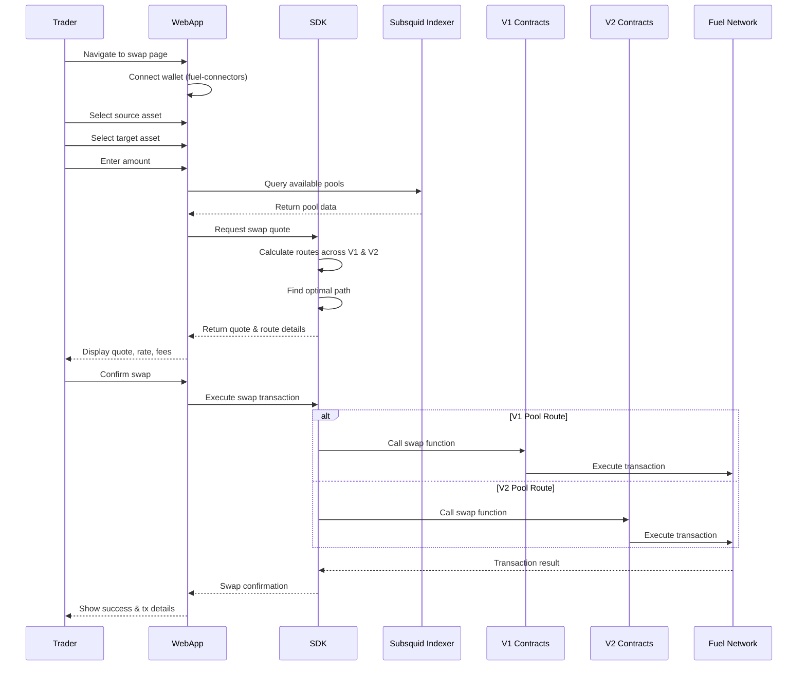
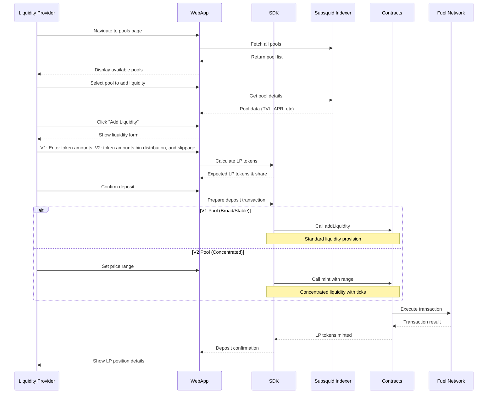
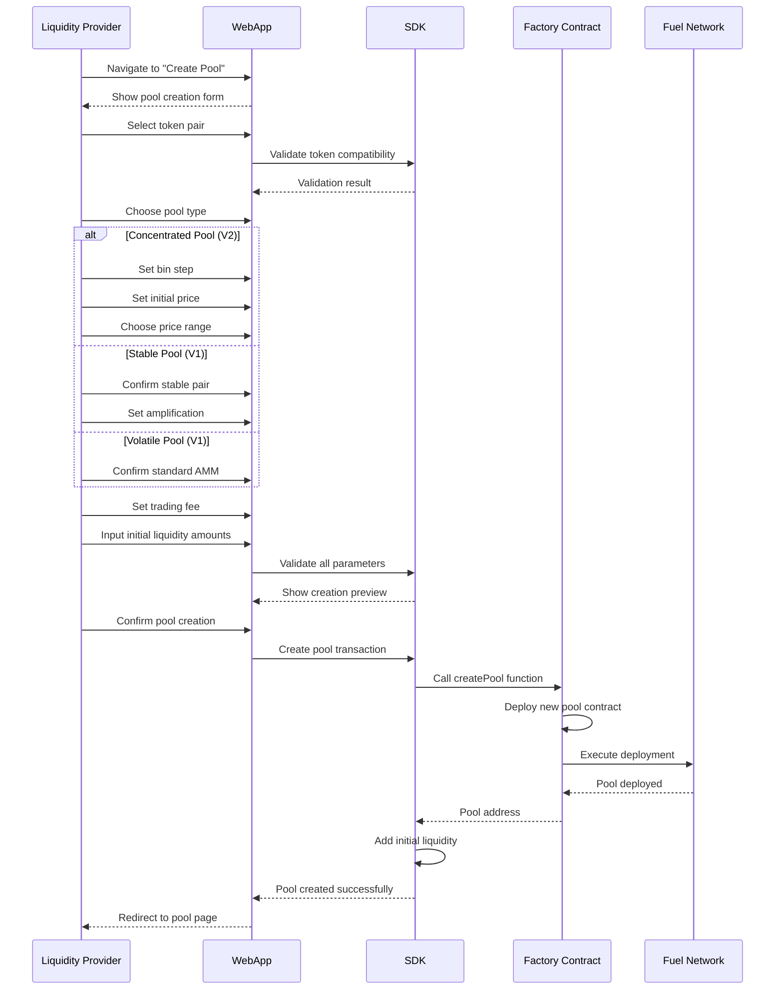
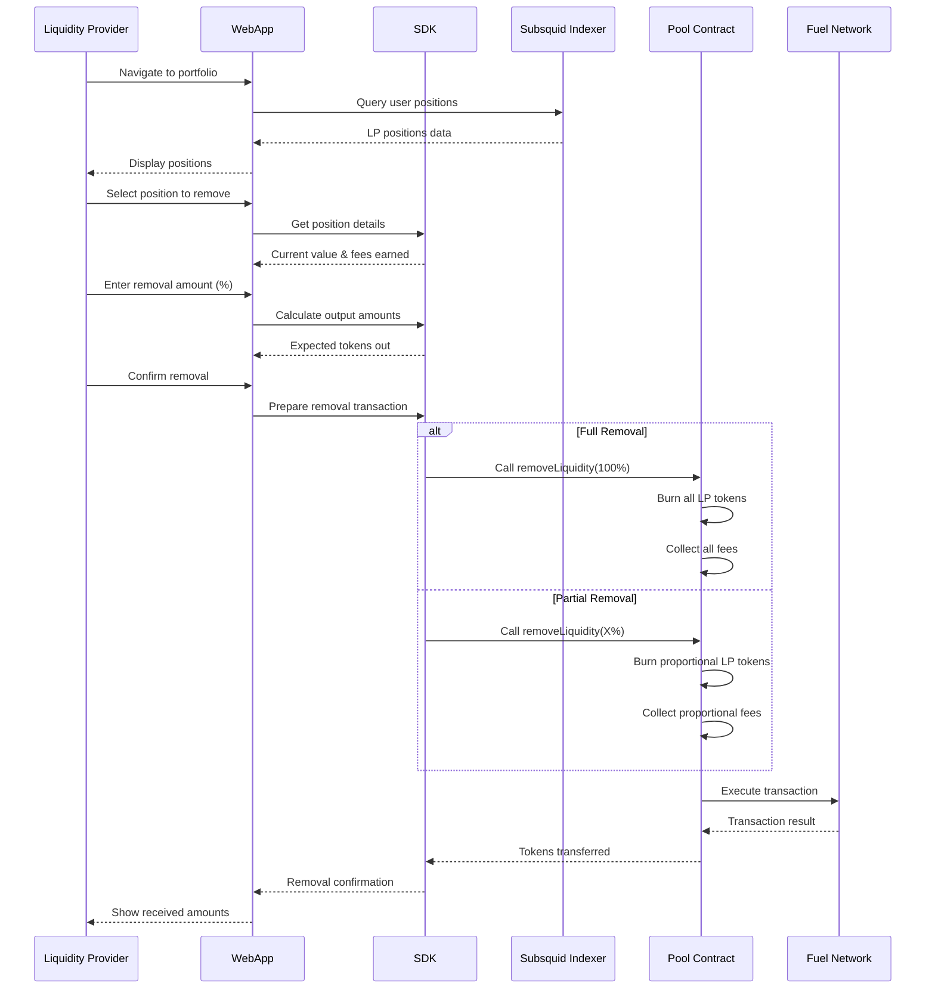
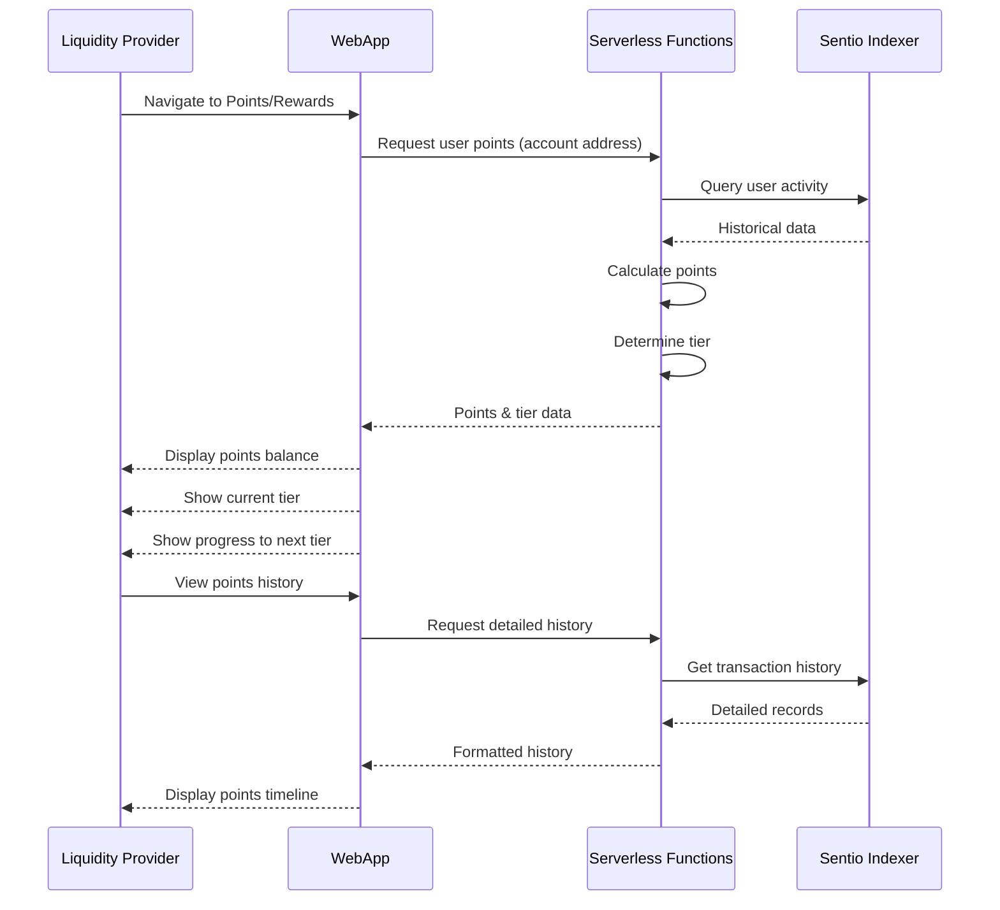
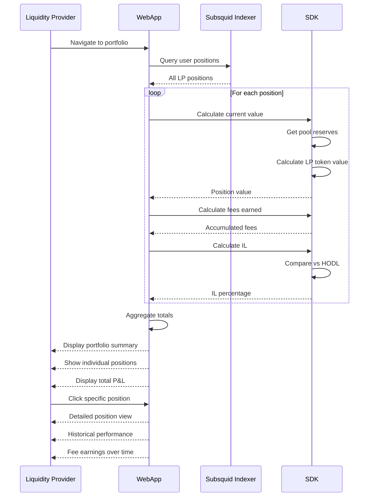
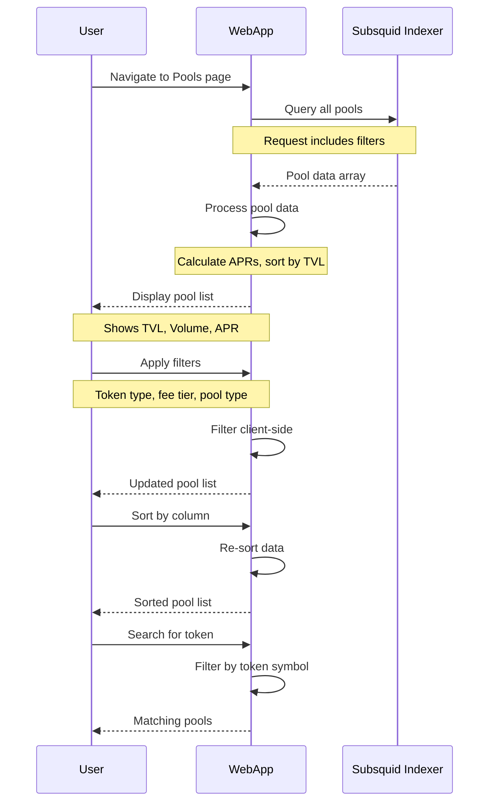
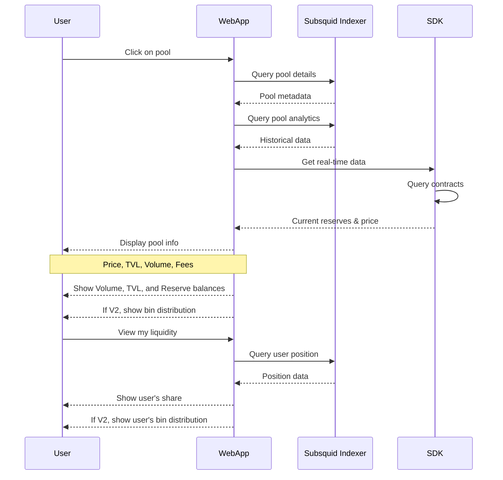

# Sequence Diagrams

## Overview

This document contains detailed sequence diagrams for all major user flows in the Mira AMM platform.

> Note: With the addition of binned liquidity contracts we now have two sets of SDKs and Contracts.
> For liquidity operations, the version used is determined by the pool type and the user selection.
> For swaps, routing is done in the SDK. WE DO NOT CURRENTLY SUPPORT CROSS CONTRACT SWAPS (I.e. V1 +
> V2 liquidity for a single atomic swap)

## 1. Swap Assets

## 2. Deposit Liquidity

## 3. Create New Pool

## 4. Remove Liquidity

## 5. Check Points Status

## 6. Check Liquidity Status

## 7. View Pool List

## 8. View Pool Details

