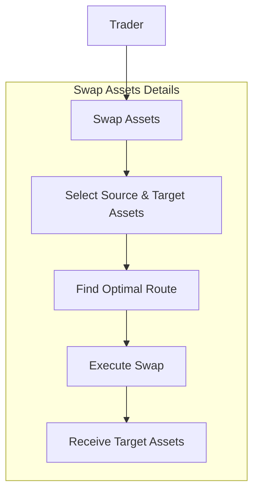
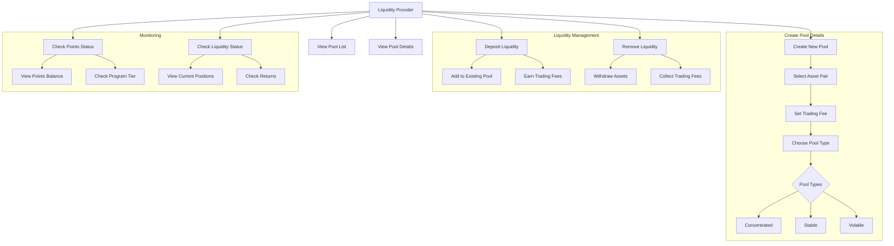
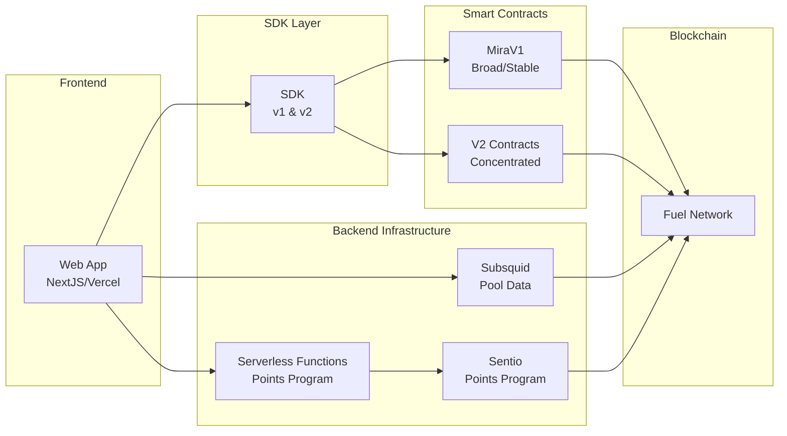
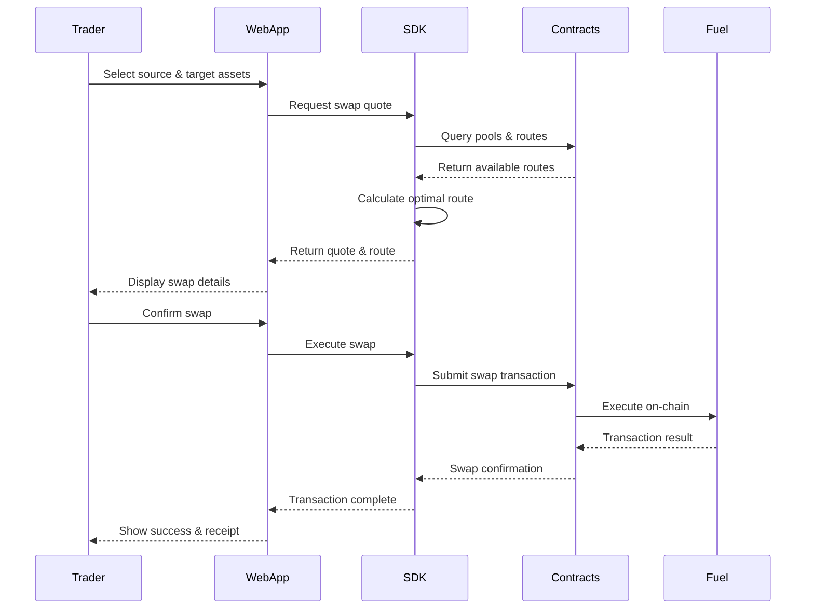
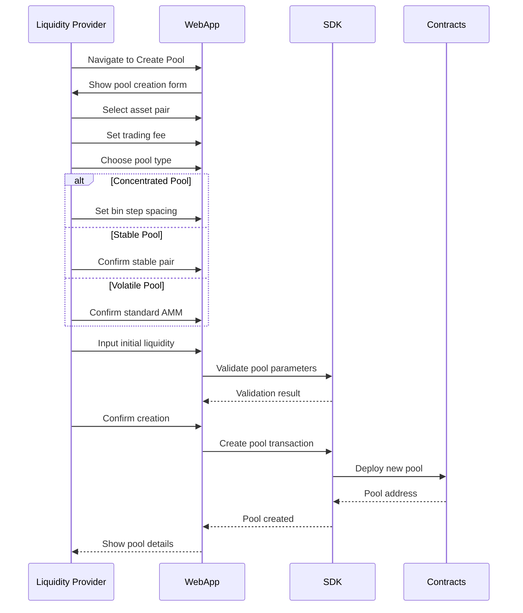

# Use Case Diagrams

## Overview
This document contains use case diagrams for the Mira AMM platform, derived from the architecture brief.

## Trader Use Cases

## Liquidity Provider Use Cases

## System Components Interaction

## Detailed Use Case: Swap Assets

## Detailed Use Case: Create New Pool

