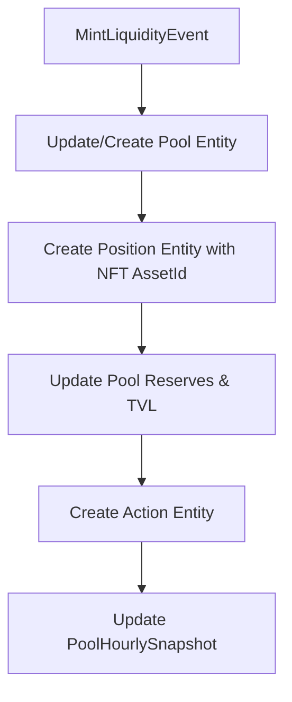
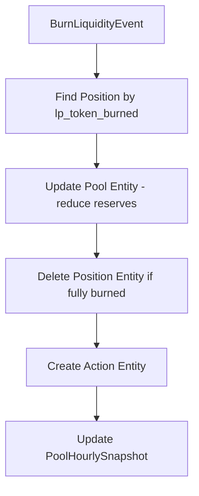
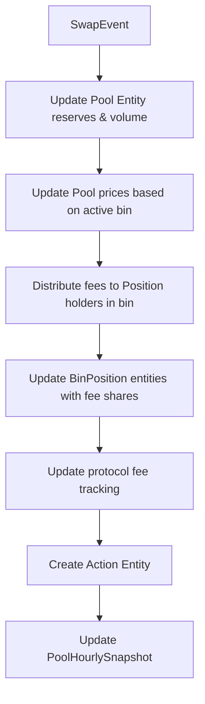
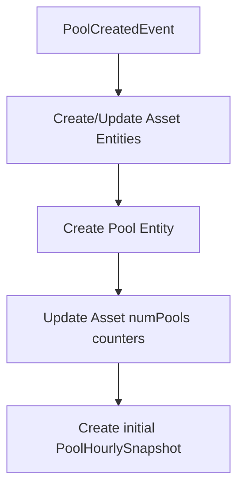
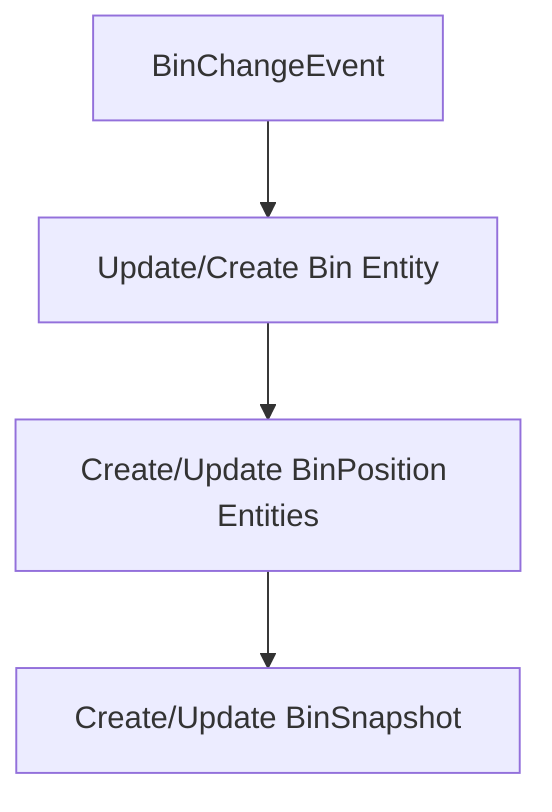

# V2 Event Processing Flowcharts

This document shows the step-by-step entity modifications required for each V2 concentrated liquidity event type.

## Event Types Overview

Based on the ABI analysis, V2 supports the following event types:
- **MintLiquidityEvent**: Adding liquidity to specific bins
- **BurnLiquidityEvent**: Removing liquidity from specific bins
- **SwapEvent**: Trading between assets through bins
- **PoolCreatedEvent**: Creating new concentrated liquidity pools
- **BinChangeEvent**: Tracking granular bin-level state changes

## 1. MintLiquidityEvent

**Event Fields:**
- `sender`: Identity - who initiated the mint
- `to`: Identity - who receives the position NFT
- `pool_id`: u256 - pool identifier
- `bin_ids`: Vec<u32> - array of bin IDs receiving liquidity
- `amounts`: Vec<Amounts> - amounts added to each bin
- `lp_token_minted`: AssetId - the NFT position token created

**Entity Modification Flow:**



**Step-by-step modifications:**

1. **Pool Entity Updates:**
   - Increment `reserve0`, `reserve1` based on amounts
   - Recalculate `tvlUSD`
   - Update `price0`, `price1` if active bin affected

2. **Position Entity Creation:**
   - Set `id` = `lp_token_minted` (NFT AssetId)
   - Set `pool` = pool reference
   - Set `createdAtBlock`, `createdAtTimestamp`

3. **Action Entity Creation:**
   - Set `type` = ADD_LIQUIDITY
   - Record amounts, recipient, etc.

4. **Snapshot Updates:**
   - Update PoolHourlySnapshot with new values

## 2. BurnLiquidityEvent

**Event Fields:**
- `sender`: Identity - who initiated the burn
- `to`: Identity - who receives the withdrawn assets
- `pool_id`: u256 - pool identifier
- `bin_ids`: Vec<u32> - array of bin IDs losing liquidity
- `amounts_withdrawn`: Vec<Amounts> - amounts withdrawn from each bin
- `lp_token_burned`: AssetId - the NFT position token burned

**Entity Modification Flow:**



**Step-by-step modifications:**

1. **Find Existing Entities:**
   - Locate Position by `lp_token_burned` AssetId

2. **Pool Entity Updates:**
   - Decrement `reserve0`, `reserve1`
   - Recalculate `tvlUSD`
   - Update `price0`, `price1` if active bin affected

3. **Position Entity Management:**
   - If position fully burned, delete Position entity
   - Otherwise, update Position metadata

4. **Action Entity Creation:**
   - Set `type` = REMOVE_LIQUIDITY
   - Record amounts, recipient, etc.

5. **Snapshot Updates:**
   - Update PoolHourlySnapshot

## 3. SwapEvent

**Event Fields:**
- `sender`: Identity - who initiated the swap
- `to`: Identity - who receives the output tokens
- `pool_id`: u256 - pool identifier
- `bin_id`: u32 - the specific bin where swap occurred
- `amounts_in`: Amounts - input amounts
- `amounts_out`: Amounts - output amounts
- `total_fees`: Amounts - total fees paid
- `protocol_fees`: Amounts - protocol portion of fees

**Entity Modification Flow:**



**Step-by-step modifications:**

1. **Pool Entity Updates:**
   - Update `reserve0`, `reserve1` based on net amounts
   - Add to `volumeAsset0`, `volumeAsset1`, `volumeUSD`
   - Add to `feesUSD`
   - Update `price0`, `price1` from new bin price

2. **Fee Distribution:**
   - Calculate fee per share in the bin
   - Update all BinPosition entities in this bin:
     - Add to `feesX`, `feesY` based on shares owned

3. **Action Entity Creation:**
   - Set `type` = SWAP
   - Record input/output amounts, fees, etc.

4. **Snapshot Updates:**
   - Update PoolHourlySnapshot with volume and fees

## 4. PoolCreatedEvent

**Event Fields:**
- `creator`: Identity - who created the pool
- `pool_id`: u256 - new pool identifier
- `asset_x`: AssetId - first asset in pool
- `asset_y`: AssetId - second asset in pool
- `bin_step`: u16 - price increment between bins
- `active_id`: u32 - initial active bin ID

**Entity Modification Flow:**



**Step-by-step modifications:**

1. **Asset Entity Updates:**
   - Create Asset entities for `asset_x`, `asset_y` if not exist
   - Increment `numPools` for both assets

2. **Pool Entity Creation:**
   - Set `id` = `pool_id`
   - Link `asset0`, `asset1` to Asset entities
   - Set `protocolVersion` = "v2"
   - Set `binStep` = bin_step parameter
   - Set `activeId` = active_id
   - Calculate and set `baseFee` from bin_step (baseFee = bin_step * 0.0001)
   - Initialize reserves, prices, volumes to 0
   - Set creation metadata

3. **Snapshot Initialization:**
   - Create initial PoolHourlySnapshot

## 5. BinChangeEvent

**Event Fields:**

```rust
/// Event emitted when liquidity distribution changes within a bin
///
/// # Fields
///
/// * `pool_id` - The pool identifier where the bin change occurred
/// * `bin_id` - The specific bin that was modified
/// * `old_reserve_x` - Previous reserve amount of asset X in the bin
/// * `old_reserve_y` - Previous reserve amount of asset Y in the bin
/// * `new_reserve_x` - New reserve amount of asset X in the bin
/// * `new_reserve_y` - New reserve amount of asset Y in the bin
/// * `old_total_shares` - Previous total LP shares in the bin
/// * `new_total_shares` - New total LP shares in the bin
/// * `triggered_by` - The transaction type that caused this change (mint, burn, swap)
/// * `position_id` - Optional position asset ID if change is position-specific
pub struct BinChangeEvent {
    pub pool_id: u256,
    pub bin_id: u32,
    pub old_reserve_x: u64,
    pub old_reserve_y: u64,
    pub new_reserve_x: u64,
    pub new_reserve_y: u64,
    pub old_total_shares: u64,
    pub new_total_shares: u64,
    pub triggered_by: BinChangeType,
    pub position_id: Option<AssetId>,
}

/// Enum representing the type of operation that triggered a bin change
pub enum BinChangeType {
    Mint,
    Burn,
    Swap,
}
```

**Entity Modification Flow:**



**Step-by-step modifications:**

1. **Bin Entity Updates:**
   - **Find/Create**: Locate Bin by `pool_id` and `bin_id`, create if doesn't exist
   - **reserveX**: Set to `new_reserve_x` from event
   - **reserveY**: Set to `new_reserve_y` from event
   - **liquidity**: Calculated from reserves and price
   - **totalSupply**: Set to `new_total_shares` from event
   - **price**: Calculate using `basePrice * (1 + binStep/10000)^binId`
   - **isActive**: Set to `true` if `bin_id` equals pool's `activeBinId`
   - **tvlUSD**: Calculate from reserves and token prices
   - **accTokenXPerShare**: Update based on fee distribution
   - **accTokenYPerShare**: Update based on fee distribution
   - **lastUpdateBlock**: Set to current block number
   - **lastUpdateTime**: Set to current timestamp

2. **BinPosition Entity Management:**
   - **Determine Position**: Use `position_id` from event (if provided)
   - **Find/Create BinPosition**: Locate by position and bin IDs
   - **liquidityShares**: Calculate share changes from total supply delta
   - **positionReserveX**: Calculate proportional share of bin's reserveX
   - **positionReserveY**: Calculate proportional share of bin's reserveY
   - **positionReserveXDecimal**: Convert to decimal representation
   - **positionReserveYDecimal**: Convert to decimal representation
   - **feesX**: Update accumulated fees based on `accTokenXPerShare`
   - **feesY**: Update accumulated fees based on `accTokenYPerShare`
   - **positionTvlUSD**: Calculate USD value of position's reserves
   - **lastUpdateBlock**: Set to current block number
   - **lastUpdateTime**: Set to current timestamp
   - **Delete logic**: Remove BinPosition if `liquidityShares` becomes zero

3. **BinSnapshot Creation or Update:**
   - **Find PoolHourlySnapshot**: Get current hourly snapshot for the pool
   - **Create or find existing BinSnapshot**: Link to both bin and pool snapshot
   - **timestamp**: Use pool snapshot timestamp for consistency
   - **reserveX**: Set to updated bin's reserveX
   - **reserveY**: Set to updated bin's reserveY
   - **liquidity**: Set to updated bin's liquidity
   - **totalSupply**: Set to updated bin's totalSupply
   - **price**: Set to bin's calculated price
   - **volumeX**: Calculate from operation type and amounts
   - **volumeY**: Calculate from operation type and amounts
   - **feesX**: Calculate fees generated for this bin
   - **feesY**: Calculate fees generated for this bin

**Use Cases:**
- **Bin State Management**: Track individual bin reserve and share changes
- **Position Tracking**: Manage user position allocations across bins
- **Snapshot Creation**: Maintain historical bin state records

**Critical constraints:**
- Position IDs must match NFT AssetIds exactly
- BinPosition entities track individual user shares in specific bins
- Fee distribution requires updating all BinPosition entities in affected bins
- Snapshots maintain temporal consistency with foreign keys
