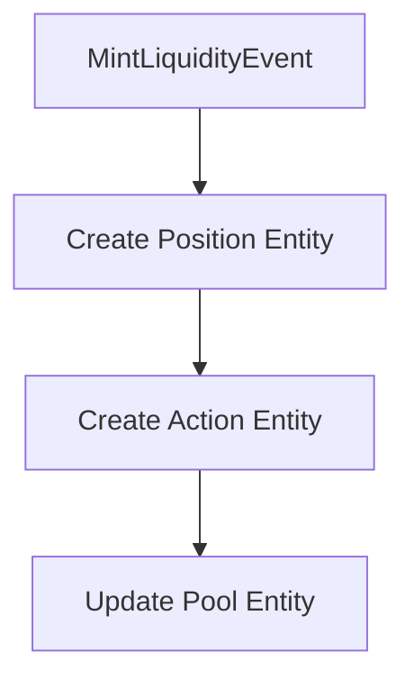
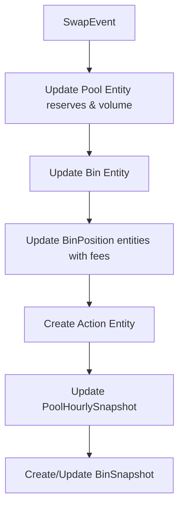
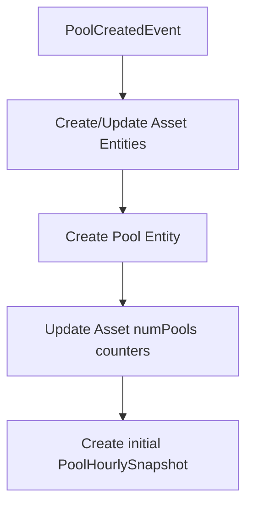
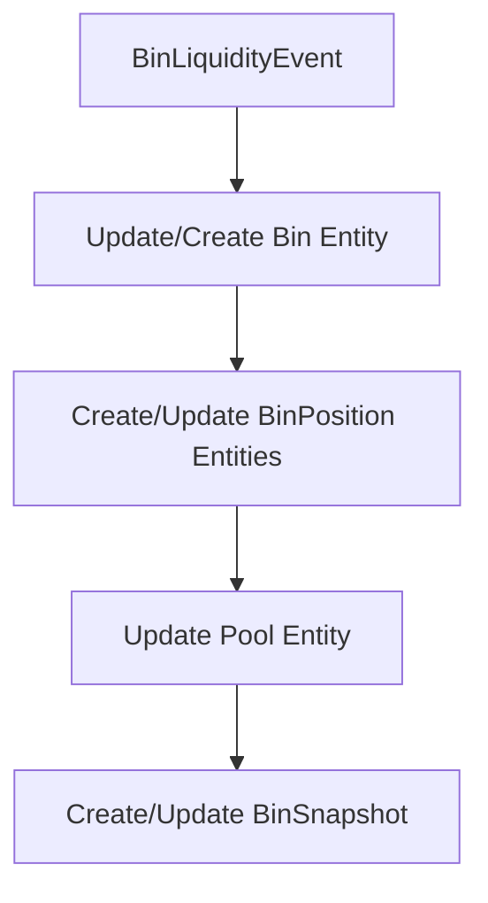

# V2 Event Processing Flowcharts

This document shows the step-by-step entity modifications required for each V2 concentrated
liquidity event type.

## Event Types Overview

Based on the ABI analysis, V2 supports the following event types:

- **MintLiquidityEvent**: Adding liquidity to specific bins
- **BurnLiquidityEvent**: Removing liquidity from specific bins
- **SwapEvent**: Trading between assets through bins
- **PoolCreatedEvent**: Creating new concentrated liquidity pools
- **BinLiquidityEvent**: Tracking granular bin-level state changes
- **CompositionFeesEvent**: Composition fee collected when adding liquidity

## 1. MintLiquidityEvent

**Event Fields:**

- `sender`: Identity - who initiated the mint
- `to`: Identity - who receives the position NFT
- `pool_id`: u256 - pool identifier
- `lp_token_minted`: AssetId - the NFT position token created

**Entity Modification Flow:**



**Step-by-step modifications:**

1. **Position Entity Creation:**
   - Create entity with `nftAssetId` = `lp_token_minted` (primary key)
   - Set `pool` = `pool_id` reference
   - Set `creationBlock`, `creationTime`, `creationTx` from transaction data

2. **Action Entity Creation:**
   - Set `type` = ADD_LIQUIDITY_V2
   - Set `pool` = `pool_id` reference
   - Set `position` = `lp_token_minted` (Position entity reference)
   - Set `recipient` = `to` from event
   - Set `asset0`, `asset1` from pool data
   - Set transaction metadata (`blockNumber`, `timestamp`, `transaction`)
   - Set `amount0In`, `amount1In`, `amount0Out`, `amount1Out` to 0 (no direct amounts in this event)
   - Set `reserves0Before`, `reserves1Before`, `reserves0After`, `reserves1After` from pool state
   - Set `binIds` array (will be populated by subsequent BinLiquidityEvent)
   - Set `activeBinBefore`, `activeBinAfter` from pool state
   - Set `priceBefore`, `priceAfter` from pool state

**Note:** The actual liquidity amounts and bin updates are handled by the BinLiquidityEvent that follows this event. The MintLiquidityEvent only creates the position NFT and initial action record.

## 2. BurnLiquidityEvent

**Event Fields:**

- `sender`: Identity - who initiated the burn
- `to`: Identity - who receives the withdrawn assets
- `pool_id`: u256 - pool identifier
- `lp_token_burned`: AssetId - the NFT position token burned

**Entity Modification Flow:**

```mermaid
graph TD
    A[BinLiquidityEvent(s) - burns] --> B[Create/Update REMOVE_LIQUIDITY_V2 Action]
    B --> C[BurnLiquidityEvent]
    C --> D[Delete Position entity]
```

**Step-by-step modifications:**

1. **Order of processing (critical):**
   - Process all burn-related `BinLiquidityEvent`(s) first within the transaction.
   - Then process `BurnLiquidityEvent`.

2. **Single action in BurnLiquidityEvent:**
   - Delete the `Position` entity identified by `nftAssetId = lp_token_burned`.

3. **No other mutations here:**
   - Do not touch `BinPosition`, `Pool`, snapshots, or create/update `Action` here.
   - `Action` aggregation and bin/share updates are handled by the preceding `BinLiquidityEvent`(s).

**Note:** `BurnLiquidityEvent` finalizes the position NFT lifecycle by removing the `Position` after all bin-level burns have been applied.

## 3. SwapEvent

**Event Fields:**

- `sender`: Identity - who initiated the swap
- `to`: Identity - who receives the output tokens
- `pool_id`: u256 - pool identifier
- `bin_id`: u32 - the specific bin where swap occurred
- `amounts_in`: Amounts - input amounts
- `amounts_out`: Amounts - output amounts
- `total_fees`: Amounts - total fees paid
- `protocol_fees`: Amounts - protocol portion of fees

**Entity Modification Flow:**



**Step-by-step modifications:**

1. **Pool Entity Updates:**
   - Update `reserve0`, `reserve1` based on net amounts from `amounts_in` and `amounts_out`
   - Update `reserve0Decimal`, `reserve1Decimal` (calculated)
   - Add to `volumeAsset0`, `volumeAsset1` from `amounts_in` and `amounts_out`
   - Update `volumeAsset0Decimal`, `volumeAsset1Decimal` (calculated)
   - Add to `volumeUSD` (calculated from volume amounts)
   - Add to `feesUSD` from `total_fees`
   - Update `tvlUSD` (recalculated)
   - Update `price0`, `price1` from bin price

2. **Bin Entity Updates:**
   - Find Bin by `pool_id` and `bin_id`
   - Update `reserveX`, `reserveY` based on swap amounts
   - Update `liquidity` (recalculated)
   - Update `reserveXPerShare`, `reserveYPerShare` (recalculated)
   - Update `lastUpdateBlock`, `lastUpdateTime`

3. **BinPosition Entity Updates:**
   - Update all BinPosition entities in the affected bin
   - Add to `feesX`, `feesY` based on proportional share of `total_fees`
   - Update `positionTVLUSD` (recalculated)
   - Update `lastUpdateBlock`, `lastUpdateTime`

4. **Action Entity Creation:**
   - Set `type` = SWAP_V2
   - Set `pool` = `pool_id` reference
   - Set `recipient` = `to` from event
   - Set `asset0`, `asset1` from pool data
   - Set transaction metadata (`blockNumber`, `timestamp`, `transaction`)
   - Set `amount0In`, `amount1In` from `amounts_in`
   - Set `amount0Out`, `amount1Out` from `amounts_out`
   - Set `reserves0Before`, `reserves1Before`, `reserves0After`, `reserves1After` from pool state
   - Set `binIds` array with `bin_id`
   - Set `activeBinBefore`, `activeBinAfter` from pool state
   - Set `priceBefore`, `priceAfter` from pool state

5. **PoolHourlySnapshot Updates:**
   - Update current hourly snapshot with volume and fees
   - Update `reserve0`, `reserve1`, `reserve0Decimal`, `reserve1Decimal`
   - Add to `volumeAsset0`, `volumeAsset1`, `volumeAsset0Decimal`, `volumeAsset1Decimal`
   - Add to `volumeUSD`, `feesUSD`
   - Update `tvlUSD`, `price0`, `price1`

6. **BinSnapshot Create/Update:**
   - Find BinSnapshot for the current hour (linked to current PoolHourlySnapshot and this bin).
   - If it exists, update fields below; otherwise, create it.
   - Set/Update `reserveX`, `reserveY`, `liquidity` from updated bin
   - Add to `volumeX`, `volumeY` using swap amounts
   - Add to `feesX`, `feesY` from `total_fees`

## 4. PoolCreatedEvent

**Event Fields:**

- `creator`: Identity - who created the pool
- `pool_id`: u256 - new pool identifier
- `asset_x`: AssetId - first asset in pool
- `asset_y`: AssetId - second asset in pool
- `bin_step`: u16 - price increment between bins
- `active_id`: u32 - initial active bin ID

**Entity Modification Flow:**



**Step-by-step modifications:**

1. **Asset Entity Updates:**
   - Create Asset entities for `asset_x`, `asset_y` if not exist
   - Increment `numPools` for both assets

2. **Pool Entity Creation:**
   - Set `id` = `pool_id`
   - Link `asset0` = `asset_x`, `asset1` = `asset_y` to Asset entities
   - Set `isStable` = false (V2 pools are not stable)
   - Set `lpToken` = null (V2 pools don't have LP tokens)
   - Initialize `reserve0`, `reserve1` = 0
   - Initialize `reserve0Decimal`, `reserve1Decimal` = "0"
   - Initialize `tvlUSD` = 0
   - Initialize `price0`, `price1` = "0"
   - Initialize `volumeAsset0`, `volumeAsset1` = 0
   - Initialize `volumeAsset0Decimal`, `volumeAsset1Decimal` = "0"
   - Initialize `volumeUSD` = 0
   - Initialize `feesUSD` = "0"
   - Set `creationBlock`, `creationTime`, `creationTx` from transaction data
   - Set `protocolVersion` = 2
   - Set `activeBinId` = `active_id`
   - Set `globalLiquidity` = 0

3. **Snapshot Initialization:**
   - Create initial PoolHourlySnapshot with all fields set to 0 or current values
   - Set `pool` reference to created pool
   - Set `timestamp` to current time
   - Set `activeBinId` = `active_id`
   - Set `globalLiquidity` = 0

## 5. BinLiquidityEvent

**Event Fields:**

```rust
/// Asset amounts with explicit X and Y amounts
///
/// This struct represents the amounts of two assets in a pool or bin or fees owed.
/// The x field is the amount of asset X, the y field is the amount of asset Y.
pub struct Amounts {
   x: u64,
   y: u64,
}
/// Event emitted when liquidity distribution changes within a bin
///
/// # Fields
///
/// * `pool_id` - The pool identifier where the bin change occurred
/// * `bin_id` - The specific bin that was modified
/// * `new_reserves` - New reserves in the bin
/// * `new_total_shares` - New total LP shares in the bin
/// * `triggered_by` - The transaction type that caused this change (mint, burn, swap)
/// * `position_id` - Optional position asset (LP token) ID if change is position-specific
pub struct BinLiquidityEvent {
    pub pool_id: PoolId,
    pub bin_id: BinId,
    pub new_reserves: Amounts,
    pub new_total_shares: u256,
    pub triggered_by: BinLiquidityChangeType,
    pub position_id: AssetId,
}

/// Enum representing the type of operation that triggered a bin change
pub enum BinLiquidityChangeType {
    Mint: (),
    Burn: (),
}
```

**Entity Modification Flow:**



**Step-by-step modifications:**

1. **Bin Entity Updates:**
   - **Find/Create**: Locate Bin by `pool_id` and `bin_id`, create if doesn't exist
   - **reserveX**: Set to `new_reserves.x` from event
   - **reserveY**: Set to `new_reserves.y` from event
   - **liquidity**: Calculated from reserves and price
   - **totalLiquidityShares**: Set to `new_total_shares` from event
   - **price**: Calculate using `(1 + binStepBps/10000)^(binId - REAL_ID_SHIFT)`
   - **isActive**: Set to `true` if `bin_id` equals pool's `activeBinId`
   - **reserveXPerShare**: Calculate as `reserveX / totalLiquidityShares`
   - **reserveYPerShare**: Calculate as `reserveY / totalLiquidityShares`
   - **lastUpdateBlock**: Set to current block number
   - **lastUpdateTime**: Set to current timestamp

2. **BinPosition Entity Management:**
   - **Determine Position**: Use `position_id` from event (if provided)
   - **Find/Create BinPosition**: Locate by position and bin IDs
   - **liquidityShares**: Calculate share changes from total supply delta
   - **mintedReserveX**: Calculate proportional share of bin's reserveX
   - **mintedReserveY**: Calculate proportional share of bin's reserveY
   - **redeemableReserveX**: Set to same as mintedReserveX (for now)
   - **redeemableReserveY**: Set to same as mintedReserveY (for now)
   - **feesX**: Update accumulated fees (if applicable)
   - **feesY**: Update accumulated fees (if applicable)
   - **positionTVLUSD**: Calculate USD value of position's reserves
   - **lastUpdateBlock**: Set to current block number
   - **lastUpdateTime**: Set to current timestamp
   - **Deletion rule**: If this burn reduces `liquidityShares` to zero for this bin, delete the `BinPosition` here (not in `BurnLiquidityEvent`).

3. **Pool Entity Updates:**
   - Update `reserve0`, `reserve1` with net changes from bin updates
   - Update `reserve0Decimal`, `reserve1Decimal` (calculated)
   - Update `tvlUSD` (recalculated from all bins)
   - Update `globalLiquidity` (sum of all bin liquidity)
   - Update `price0`, `price1` from active bin price

4. **BinSnapshot Creation or Update:**
   - **Find PoolHourlySnapshot**: Get current hourly snapshot for the pool
   - **Create or find existing BinSnapshot**: Link to both bin and pool snapshot
   - **timestamp**: Use pool snapshot timestamp for consistency
   - **reserveX**: Set to updated bin's reserveX
   - **reserveY**: Set to updated bin's reserveY
   - **liquidity**: Set to updated bin's liquidity
   - **tvlUSD**: Calculate USD value of bin reserves
   - **volumeX**: Calculate from operation type and amounts
   - **volumeY**: Calculate from operation type and amounts
   - **feesX**: Calculate fees generated for this bin (if applicable)
   - **feesY**: Calculate fees generated for this bin (if applicable)

**Use Cases:**

- **Bin State Management**: Track individual bin reserve and share changes
- **Position Tracking**: Manage user position allocations across bins
- **Snapshot Creation**: Maintain historical bin state records

**Critical constraints:**

- Position IDs must match NFT AssetIds exactly
- BinPosition entities track individual user shares in specific bins
- Fee distribution requires updating all BinPosition entities in affected bins
- Snapshots maintain temporal consistency with foreign keys

**Action Aggregation for Burns (REMOVE_LIQUIDITY_V2):**
- On the first `BinLiquidityEvent` in a tx that touches a given `position` with a burn, create an `Action` with `type = REMOVE_LIQUIDITY_V2` and initialize amounts and `binIds`.
- On subsequent `BinLiquidityEvent`s in the same tx for that `position`, update the same `Action` aggregating amounts and appending `binIds`.

## 6. CompositionFeesEvent

**Event Fields:**

```rust
pub struct CompositionFeesEvent {
   pub sender: Identity,
   pub pool_id: PoolId,
   pub bin_id: u256,
   pub total_fees: Amounts,
   pub protocol_fees: Amount,
}
```

**Entity Modification Flow:**

```mermaid
graph TD
    A[CompositionFeesEvent] --> B[Update Pool fees]
    B --> C[Update Bin timestamps]
    C --> D[Update PoolHourlySnapshot fees]
    D --> E[Update existing BinSnapshot (if present)]
```

**Step-by-step modifications:**

1. **Pool Entity Updates:**
   - Add to `feesUSD` from `total_fees` (converted to USD)

2. **Bin Entity Updates:**
   - Find Bin by `pool_id` and `bin_id`
   - Update `lastUpdateBlock`, `lastUpdateTime`

3. **PoolHourlySnapshot Updates:**
   - Update current hourly snapshot `feesUSD` (add fees converted to USD)

4. **BinSnapshot Update (if exists):**
   - Find BinSnapshot linked to the current PoolHourlySnapshot for this `bin_id`
   - If found, add `feesX`, `feesY` from `total_fees`
   - Leave `reserveX`, `reserveY`, `liquidity`, `volumeX`, `volumeY` unchanged
   - If not found, do nothing (do not create a new BinSnapshot for fees-only events)

**Use Cases:**

- **Fee Collection**: Track composition fees collected when adding liquidity
- **Protocol Revenue**: Monitor protocol fee accumulation
- **Position Fee Updates**: Update individual position fee accumulations
