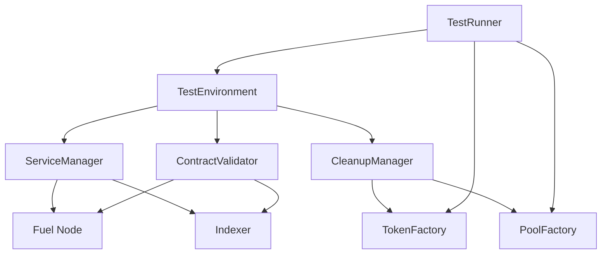

# Enhanced Integration Test Infrastructure

This directory contains the enhanced test infrastructure for Mira AMM V2 SDK integration tests. The
infrastructure addresses the contract synchronization issues identified in previous testing and
provides robust, reliable test execution.

## Components

### ServiceManager (`service-manager.ts`)

Manages the lifecycle of Fuel node and indexer services using nx tasks.

**Features:**

- Automatic service startup via `pnpm nx dev indexer`
- Health monitoring and readiness checks
- Graceful shutdown and cleanup
- Service status validation

**Usage:**

```typescript
import {serviceManager} from "./setup/service-manager";

// Start all services
await serviceManager.startServices();

// Check service health
const statuses = await serviceManager.checkAllServices();

// Stop all services
await serviceManager.stopAllServices();
```

### ContractValidator (`contract-validator.ts`)

Validates contract deployment and accessibility to address synchronization issues.

**Features:**

- Contract deployment validation
- Contract accessibility verification
- Indexer synchronization checks
- Comprehensive readiness validation

**Usage:**

```typescript
import {ContractValidator} from "./setup/contract-validator";

const validator = new ContractValidator(provider);

// Validate all contracts
const result = await validator.validateAllContracts();

// Wait for contracts to be ready
await validator.waitForContractsReady();

// Perform comprehensive readiness check
await validator.performReadinessCheck();
```

### CleanupManager (`cleanup-manager.ts`)

Manages test data cleanup and environment teardown.

**Features:**

- Wallet tracking and cleanup
- Temporary file management
- Test data cleanup
- Custom cleanup operations
- Emergency cleanup for error scenarios

**Usage:**

```typescript
import {CleanupManager} from "./setup/cleanup-manager";

const cleanup = new CleanupManager(provider);

// Register resources for cleanup
cleanup.registerWallet(wallet);
cleanup.registerTempFile("/tmp/test-data.json");

// Perform cleanup
await cleanup.quickCleanup(); // For test isolation
await cleanup.fullCleanup(); // For test suite completion
```

### TestRunner (`test-runner.ts`)

Enhanced test runner with error handling, retries, and isolation.

**Features:**

- Automatic environment setup and teardown
- Test isolation and cleanup
- Error handling with retries
- Timeout management
- Prerequisite validation

**Usage:**

```typescript
import {defaultTestRunner} from "./setup/test-runner";

// Setup test environment
await defaultTestRunner.setup();

// Run a test with enhanced error handling
await defaultTestRunner.runTest(
  "my-test",
  async () => {
    // Test implementation
  },
  {
    timeout: 30000,
    retries: 2,
  }
);

// Teardown
await defaultTestRunner.teardown();
```

### Enhanced TestEnvironment (`test-environment.ts`)

Updated test environment that integrates all new infrastructure components.

**New Features:**

- Automatic service management
- Contract validation integration
- Enhanced cleanup capabilities
- Service health monitoring

### WalletFactory (`wallet-factory.ts`)

Comprehensive wallet management for creating and funding test wallets.

**Features:**

- Create wallets with ETH and token funding
- Scenario-specific wallet creation (liquidity provider, trader, etc.)
- Batch wallet creation with consistent configuration
- Balance validation and monitoring
- Wallet statistics and reporting

**Usage:**

```typescript
import {WalletFactory} from "./setup/wallet-factory";

const walletFactory = new WalletFactory(provider, masterWallet, tokenFactory);

// Create basic wallet
const wallet = await walletFactory.createWallet({
  name: "test-wallet",
  initialBalance: "5000000000000000000", // 5 ETH
  tokens: [{symbol: "USDC", amount: tokenFactory.getStandardAmount("USDC", 1000)}],
});

// Create scenario wallets
const scenarios = await walletFactory.createScenarioWallets();
```

### Enhanced TokenFactory (`token-factory.ts`)

Extended token management with advanced utilities for test scenarios.

**New Features:**

- Detailed balance information with formatting
- Batch token minting operations
- Scenario-based amount generation
- Token configuration validation
- Balance sufficiency checking

**Usage:**

```typescript
// Get detailed balance info
const balanceDetails = await tokenFactory.getBalanceDetails(address, "USDC");

// Check sufficient balance
const hasSufficient = await tokenFactory.hasSufficientBalance(address, "USDC", requiredAmount);

// Generate scenario amounts
const whaleAmounts = tokenFactory.getScenarioAmounts("whale");
```

### TransactionUtilities (`transaction-utilities.ts`)

Enhanced transaction execution with monitoring and error handling.

**Features:**

- Transaction execution with retries and timeouts
- Balance change tracking during transactions
- Gas estimation and validation
- Batch transaction execution
- Transaction indexing verification

**Usage:**

```typescript
import {TransactionUtilities} from "./setup/transaction-utilities";

const txUtils = new TransactionUtilities(provider);

// Execute with balance tracking
const result = await txUtils.executeWithBalanceTracking(
  wallet,
  transactionRequest,
  [address1, address2],
  ["USDC", "ETH"]
);

// Batch execute transactions
const results = await txUtils.batchExecuteTransactions([
  {wallet: wallet1, request: tx1, name: "Pool Creation"},
  {wallet: wallet2, request: tx2, name: "Add Liquidity"},
]);
```

### BalanceChecker (`balance-checker.ts`)

Comprehensive balance monitoring and analysis utilities.

**Features:**

- Multi-asset balance checking
- Balance change comparison
- Threshold monitoring with alerts
- Balance history tracking
- Comprehensive reporting

**Usage:**

```typescript
import {BalanceChecker} from "./setup/balance-checker";

const balanceChecker = new BalanceChecker(provider, tokenFactory);

// Get complete wallet balance
const walletBalance = await balanceChecker.getWalletBalance(address);

// Compare balances
const changes = await balanceChecker.compareBalances(address, beforeBalance);

// Check thresholds
const thresholdCheck = balanceChecker.checkThresholds(walletBalance);
```

## Key Improvements

### 1. Contract Synchronization Fix

The infrastructure addresses the main issue identified in Task 1 - contract deployment
timing/synchronization:

- **Contract Validation**: Ensures contracts are deployed and accessible before tests run
- **Readiness Checks**: Validates both node and indexer have contract data
- **Synchronization Waiting**: Waits for proper contract deployment completion

### 2. Service Management

- **Nx Task Integration**: Uses `pnpm nx dev indexer` for consistent service startup
- **Health Monitoring**: Continuous monitoring of service health
- **Automatic Recovery**: Handles service failures gracefully

### 3. Test Isolation

- **Cleanup Between Tests**: Automatic cleanup to prevent test interference
- **Resource Tracking**: Tracks wallets, files, and test data for cleanup
- **Isolated Environments**: Creates isolated test environments per test

### 4. Error Handling

- **Retry Logic**: Automatic retries for flaky tests
- **Timeout Management**: Configurable timeouts for different operations
- **Emergency Cleanup**: Cleanup on test failures

## Usage Examples

### Basic Test Setup

```typescript
import {describe, it, beforeAll, afterAll} from "vitest";
import {defaultTestRunner, testEnvironment} from "./setup";

describe("My Integration Tests", () => {
  beforeAll(async () => {
    await defaultTestRunner.setup();
  }, 120000);

  afterAll(async () => {
    await defaultTestRunner.teardown();
  });

  it("should test something", async () => {
    await defaultTestRunner.runTest("test-name", async () => {
      // Your test implementation
    });
  });
});
```

### Isolated Test Environment

```typescript
it("should test with isolated environment", async () => {
  const env = await defaultTestRunner.createIsolatedEnvironment();

  // Use env.wallet, env.tokenFactory, env.poolFactory
  const balance = await env.wallet.getBalance();

  // Cleanup is automatic
  await env.cleanup();
});
```

### Custom Test Runner Configuration

```typescript
import {TestRunner} from "./setup/test-runner";

const customRunner = new TestRunner({
  name: "Custom Test Suite",
  timeout: 60000,
  retries: 3,
  validateContracts: true,
  cleanupBetweenTests: true,
});

await customRunner.setup();
// Run tests...
await customRunner.teardown();
```

## Configuration

### Environment Variables

- `USE_ENHANCED_INFRASTRUCTURE`: Enable enhanced infrastructure (set by test script)
- `VITEST_TIMEOUT`: Test timeout in milliseconds

### Service Configuration

Services are configured in `ServiceManager`:

- **Fuel Node**: `http://localhost:4000/v1/graphql`
- **Indexer**: `http://localhost:4350/graphql`

### Test Configuration

Default test configuration in `TestRunner`:

- **Timeout**: 120 seconds
- **Retries**: 1
- **Contract Validation**: Enabled
- **Cleanup Between Tests**: Enabled

## Troubleshooting

### Contract Synchronization Issues

If tests fail with "InputContractDoesNotExist" errors:

1. Check contract validation logs
2. Ensure `pnpm nx dev indexer` completed successfully
3. Verify contract-ids.json is recent and valid
4. Check service health status

### Service Startup Issues

If services fail to start:

1. Check port availability (4000, 4350)
2. Verify Docker is running (for indexer database)
3. Check nx task dependencies
4. Review service logs for errors

### Test Isolation Issues

If tests interfere with each other:

1. Enable cleanup between tests
2. Use isolated environments
3. Check resource tracking in CleanupManager
4. Verify wallet creation queue

## Migration from Old Infrastructure

To migrate existing tests:

1. Import from `./setup` instead of individual files
2. Use `defaultTestRunner.setup()` instead of `testEnvironment.start()`
3. Wrap test logic in `defaultTestRunner.runTest()`
4. Add `afterAll()` with `defaultTestRunner.teardown()`

### Before:

```typescript
beforeAll(async () => {
  await testEnvironment.start();
});
```

### After:

```typescript
beforeAll(async () => {
  await defaultTestRunner.setup();
});

afterAll(async () => {
  await defaultTestRunner.teardown();
});
```

## Architecture



The enhanced infrastructure provides a robust foundation for integration testing with proper service
management, contract validation, and cleanup capabilities.
